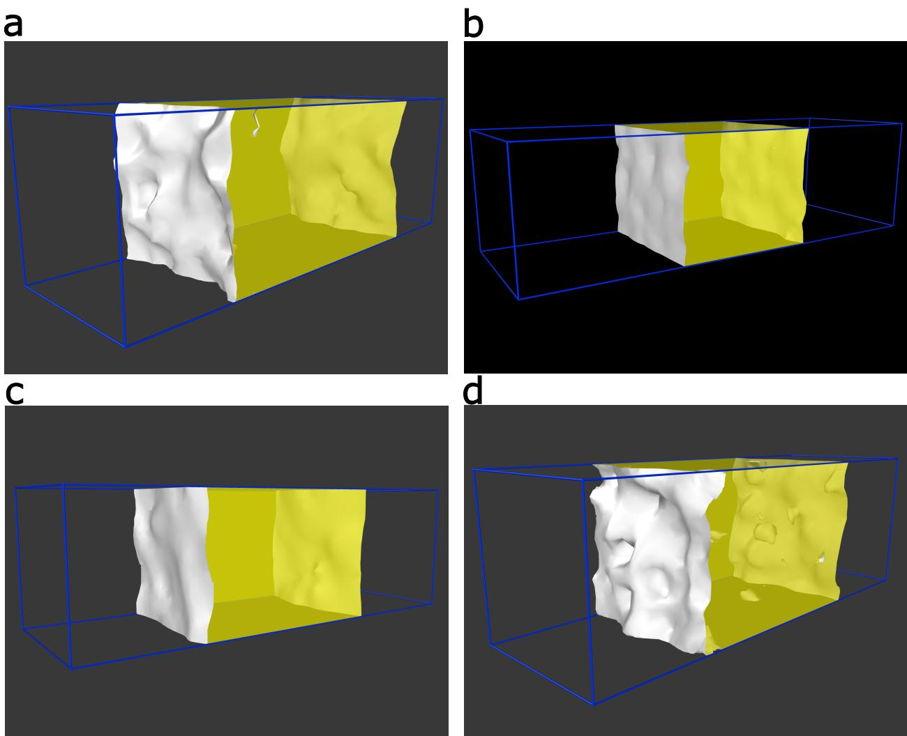

# Supplementary Information for “Monatomic glass formation through competing order balance"

Yuan-Chao Hu a, $^ { 1 , \dag }$ J. T. Zhai $^ \mathrm { a }$ ,² Le-Hua Liu, $2 , \ddagger$ W. W. Zhang, $^ 2$

Hai-Yang Bai, $^ { 1 , 3 }$ Wei-Hua Wang, $^ { 1 , 3 }$ and Hajime Tanaka $^ { 4 , 5 , \sharp }$   
$^ { 1 }$ Songshan Lake Materials Laboratory,   
Dongguan， Guangdong 523808， China   
$^ 2$ National Engineering Research Center of Near-net-shape Forming for Metallic Materials,   
Guangdong Provincial Key Laboratory for Processing   
and Forming of Advanced Metallic Materials,   
South China University of Technology, Guangzhou 510640， China   
$^ 3$ Institute of Physics， Chinese Academy of Sciences, Beijing 100190, China   
$^ 4$ Research Center for Aduanced Science and Technology,   
The University of Tokyo， 4-6-1 Komaba,   
Meguro-ku， Tokyo 153-8904， Japan   
$^ { 5 }$ Department of Fundamental Engineering,   
Institute of Industrial Science, The University of Tokyo,   
4-6-1 Komaba， Meguro-ku， Tokyo 153-8505， Japan   
(Dated: May 1, 2024)

  
Supplementary Figure 1. Comparison of the EAM potentials of Ta and Zr.a Pair potential component. b Diatom total energy obtained by summing the pair energy and embedding energy contributions. c Enlarged view of $\mathbf { b }$ ， highlighting the shallow energy minimum in Ta.d Embedding energy $F$ as a function of the local atomic electron density $\rho$ for Ta.e Dependence of atomic electron density $\rho$ on pair distance for Ta. f Embedding energy $F$ as a function of atomic electron density $\rho$ for Zr. $\mathbf { g }$ The pair distance dependence of $\rho$ for Zr. Panels a,d-g are directly obtained from the source data of the corresponding EAM potential files.

  
Supplementary Figure 2. Equations of state of several solid phases for Ta (a) and Zr (b) predicted by the EAM potentials. For both systems, five phases are considered: BCC, FCC, HCP,A15-phase,and $\sigma$ -phase.a For Ta, BCC exhibits the lowest energy minimum and is the stable phase. The A15 and $\sigma$ phases are competing metastable phases, while FCC and HCP are unfavorable relative to the others.b For Zr,HCP has the lowest energy minimum and is the stable phase. FCC and BCC are competing metastable phases,while A15 and $\sigma$ phases are unfavorable.

  
Supplementary Figure 3.Estimation of the melting temperature and enthalpy of fusion for different phases of Ta. a-c Time dependence of the potential energy $E$ for the liquid-solid coexistence configuration at various temperatures. d-f Time evolution of the enthalpy $H$ for the liquid and solid phases at the measured $T _ { \mathrm { m } }$ for different phases. In a-c and d-f, the phases considered are BCC, $\sigma$ -QCMP and A15-QCMP, respectively.

  
Supplementary Figure 4.Estimation of the melting temperature and enthalpy of fusion for the BCC phase of $\mathbf { z r }$ . a Time dependence of the potential energy $E$ for the liquidsolid coexistence configuration at various temperatures. b Time dependence of the enthalpy $H$ for the liquid and solid phases at the measured $T _ { \mathrm { m } }$

  
Supplementary Figure 5. Surface mesh of the solid phase in the liquid-solid coexistence configuration at $T _ { \mathrm { m } }$ .a BCC phase of Ta, b $\sigma$ -QCMP of Ta, c A15-QCMP of Ta, d BCC phase of Zr. The gray surface represents the liquid-solid interface, while the yelow region highlights the crystalline phase. For clarity, the liquid phase and individual atoms are omitted.

Supplementary Figure 6. Structural orderings analysis during the crystallisation process of supercooled Ta. These results complement Fig. 5a. a Lifetime analysis of local icosahedral order during crystalisation to BCC. The lifetime of local icosahedral order is measured by tracking the structural ordering of each atom in consecutive snapshots. The mean and maximum lifetimes for atoms belonging to local icosahedral order are plotted, with red and green lines representing the average values derived from maximum and mean lifetimes, respectively. b Point pattern analysis of LiqICOs at diffrent time scales. Point pattern analysis examines the spatial arrangement of LiqICOs by varying the cutoff distance $r$ to define clusters and calculating the normalised number of clusters, $N _ { \mathrm { c l u s t e r } } / N$ as a function of $r$ . We plot the normalized $N _ { \mathrm { c l u s t e r } }$ by the particle number $N$ . The distribution indicates that local icosahedral order in the liquid state deviate from a random spatial arrangement. c Time evolution of the number of atoms in newly formed QCMP (“new QCMP"） and their source contribution from pre-existing local icosahedral order (“add ICO"), focusing on icosahedral centres. This analysis paralels Fig. 5b. d,e Density profile of $w _ { 6 }$ relative to the centre-of-mass (com) of the QCMP nucleus (d) and the BCC nucleus (e). $N$ denotes the number of atoms in QCMP,and $t$ represents the time snapshot. The contrasting behavior of $\left. w _ { 6 } \right.$ between QCMP and BCC nucleation highlights the distinct roles of icosahedral-like ordering in phase transformations. The term “density profiles” refers to a binning analysis similar to $g ( r )$ ,but weighted by a physical quantity. In $\mathbf { d }$ and $\mathbf { e }$ ， particle distances to the COM of different nuclei are binned,and the averaged order parameter $\left. w _ { 6 } \right.$ is calculated for each bin. While actual density is not considered, this approach provides a structural profile of $\left. w _ { 6 } \right.$ consistent with terminology used elsewhere.

Supplementary Figure 7. Comparison of BCC and QCMP crystallisation in an independent simulation of undercooled Ta. The condition is similar to those in Fig. 5a. a Temporal evolution of different structural orderings leading to BCC crystallisation (LiqICO: ICOs in the liquid phase; FulICO: all ICOs in the system; PreBCC: BCC preordering). Preordering is observed for both BCC and QCMP phases.b-d Characteristics of the BCC nucleus at $t = 8 0 0$ ps. b Structural orderings with BCC re-centred for better visualisation. c Density profile of the bond orientational order parameter $w _ { 6 }$ from the centre-of-mass (com) of the BCC nucleus. d Density profile of PreBCC from the BCC nucleus surface. e-p QCMP growth process. e, f Time evolution of the number of atoms in the newly formed QCMP phase,sourced from existing local icosahedral order (e considering only centres) and from local icosahedral clusters (f including l2 nearest neighbours). Two QCMP nuclei are identified: g-i Structural ordering at $t = 6 0 0$ ps (g), $t = 8 0 0$ ps (h), and $t = 1 0 0 0$ ps (i),each re-centred for clarity. j-l Structural orderings of the second nucleus at the same time steps, $t = 6 0 0$ ps (j), $t = 8 0 0$ ps ( $\mathbf { \delta k }$ ),and $t = 1 0 0 0$ ps (l), with individual re-centring. $\mathbf { m }$ ， $\mathbf { I I }$ Density profiles of the first nucleus for $w _ { 6 }$ $\mathbf { m }$ ）and $f$ LiqICo( $\mathbf { n }$ ). 0-p Density profiles of the second nucleus for $w _ { 6 }$ (0) and fLiqIco (p). Dotted lines in $\mathbf { m }$ and $\mathbf { o }$ represent the radius of gyration of QCMP nuclei at different time steps. In allsnapshots, white atoms represent LiqICOs, yellow denotes QCMP, red signifies BCC, cyan indicates PreBCC, purple marks LiqICOs at the QCMP surface, and orange represents their 12 nearest neighbours.

Supplementary Figure 8. QCMP crystallisation from an independent simulation of undercooled Ta. The evolution of structural ordering is illustrated in Fig. 5k. a,b QCMP growth process. a and $\mathbf { b }$ show the time evolution of the number of atoms in the newly formed QCMP phase,derived from existing local icosahedral order (a, considering only centres） and from local icosahedral clusters (b, including 12 nearest neighbours). Two QCMP nuclei are identifed: c-e Structural orderings of the first nucleus at $t = 3 8 0$ ps (c), $t = 4 8 0$ ps (d)，and $t = 6 2 0$ ps (e), alongside other structural arrangements,each re-centred for clarity. f-h Structural orderings of the second nucleus at the corresponding time steps: $t = 3 8 0$ ps (f)， $t = 4 8 0$ ps (g)，and $t = 6 2 0$ ps (h),also re-centred for enhanced visualisation.i,j Density profiles of the first nucleus based on $w _ { 6 }$ (i) and fLiqICo (j). k,l Density profiles of the second nucleus based on $w _ { 6 }$ (k) and fLiqICo (1). Vertical dotted lines in i and $\mathbf { k }$ represent the gyration radius of QCMP at varying time steps. In all snapshots, white atoms represent LiqICOs,yellow denotes QCMP,red signifes BCC, cyan marks PreBCC, purple highlights LiqICOs at the QCMP surface,and orange represents their 12 nearest neighbours.

  
Supplementary Figure 9. Estimation of icosahedral lifespan from each atom across full crystallisation trajectory. The exemplified temperature is approximately $0 . 5 7 T _ { \mathrm { m } }$ .aTa crystallisation with two QCMP nuclei (see Supplementary Fig. 7). b Ta crystalisation where QCMP forms without BCC emergence (see Fig. 5k) c Zr crystallisation (see Fig. 6). Icosahedral lifespans are generally short but vary across different cases. In Zr, where local icosahedral order is unfavourable, many atoms never transition into icosahedral configurations, resulting in $t = 0$ ： Any transient local icosahedral order rapidly vanishes in the liquid state,leading to very short lifespans. In Ta,icosahedral lifetimes are longer than in Zr,though stil relatively brief (on the order of several ps). When BCC nucleation is absent (b), icosahedral lifetimes tend to be longer compared to cases where BCC crystallisation occurs (a).

  
Supplementary Figure 10. Diatom potential energy as a function of pair distance for four metals. Mo and Ni are machine-learning interatomic potentials [1]; Cr is described by a modifed EAM potential [2]; and Ta is modeled by a physics-informed neural network potential [3]. All these potentials have been benchmarked against experimental measurements and/or first principles calculations based on the density functional theory. Notably, none of the potentials exhibit a smooth shape, indicating that smoothness is not a necessary condition for accurately describing metallic systems.

[1] Zuo, Y. et al. Performance and cost assessment of machine learning interatomic potentials. J. Phys. Chem. A 124, 731-745 (2020).   
[2] Choi, W.-M., Kim, Y.， Seol, D.& Lee, B.-J. Modified embedded-atom method interatomic potentials for the Co-Cr, Co-Fe, Co-Mn, Cr-Mn and Mn-Ni binary systems. Comput. Mater. Sci. 130, 121-129 (2017).   
[3] Lin, Y.-S., Pun,G. P.P.& Mishin, Y. Development of a physically-informed neural network interatomic potential for tantalum. Comput. Mater. Sci. 205,111180 (2022).