# Monatomic glass formation through competing order balance

Corresponding Author: Professor Hajime Tanaka

Parts of this Peer Review File have been redacted as indicated to remove third-party material.

This file contains allreviewer reports in order by version,followed by allauthor rebuttals in order by version.

Version 0:

Reviewer comments:

Reviewer #1 (Remarks to the Author)

The manuscript "Monatomic glass formation through competing order balance" describes acomputational study of the crystalization mechanismsof twopure metals,Taand Z,whoseequlibriumcrystal phase(atnoto low temperatures)is thebccstructure.Intriguinglytheprocess takesplace much moreslowlyinTa,due tocompeting (quasi-)crystallinephases andthepaperinvestigates the mechanismsbehindthis,specificaly the orderoficosahedralordering in the supercooled liquid.Theauthors useclassical nucleationtheoryasastarting pointfromwhichtoanalyse thereason forthe diferencein crystalizationkinetics.Itisclearthatthediferences incrystal growthrates,inself-difusionintheliquidphase,andinthe thermodynamicdriving force arenotsuffcientto explaintheobserved diffrences.This leaves interfacial energyas the factorthatmustberesponsible.Indeed,theroleoficosahedralyorderedlocal environments isarguedtobe due to their effcton interfacial energyandnotonparticledynamics withinthesupercooledliquid.Theconclusionsarethaticosahedral orderingis crucial inTaandleads to non-classicalpathwaysinvolving localand hierarchicalorderings,wherehierarchical refers to the sequence atom $\textgreater$ icoshedra->quasicrystalline metastable phase (QCMP). In Zr icosahedral ordering is only minimally present,andsocrystalizationtobccproceeds without interference,thoughstllinanonclassicalmanneriasocalled pre-ordering.

Ithinkthework isvery interesting,timelyand informative,providingclearinsightinto thecrystallzation mechanismsand specificallytheirdiferences betweenthe twometals studied.Irecommenditforpublication,buttheauthors shouldconsider my comments, which essentially all concern clarification.

# General comments

1.Ithinkthe term non-clasical pathways should be elaboratedon in the introductionso the reader has someidea of what kinds of crystallization mechanisms could exist that would be considered non-classical.

2.Atafairlylate stage inwriting this reviewlrealizedlhad misunderstood some terminology.Ihadsomehow understood QCMPas referring exclusively tothe A15 phase,andtherefore readseveral statements thinking of beta-Taand QCMPas diferentphases.Itseems that QCMP is usedseveral times when specificaly the beta phase is meant.The authors should check their use of the term QCMP and mention beta-Ta explicitly if that is meant.

3.The term PreBCC was never defined.Somethingabout "crystal-like bond orientational orderings"is mentioned inthe discussion,andlcansee that theconceptwasintroducedinoneofthecitedreferences,but theconceptshould be clearly explained where it is used in the manuscript.

4.Inthe discussionitis brieflymentioned thatthe ICOpropertiesdependonthe interatomic interactions.Itwouldaddalotol value to the workifthe authorscansayanything specificabout whataspects ofthe interactionscouldliebehindtheresultsnot necessarilyregarding thereal materials,butevenat the levelof theEAMpotentials used.Cantheypointto something crucial that is different between the two models?

5.Iunderstand that Zractually exists in the hcp structure atambienttemperautre and pressure,whereas bcc becomes the equilibrium crystal phase at higher temperatures.Perhaps this should be mentioned to avoid confusion.

Detailed comments

1.Page 3Thirdparagraph,line3-4.Alitle thing:itwould helpthe reader to specifywhichcooling rate was required to amorphize Tainorder to compare to the cooling rates that would be required for fcchcp.From the reference givenl understand $\mathsf { R c } \mathsf { = } 1 0 ^ { \wedge } 1 4$ for Ta,so the point seems to be that some even higher,albeit unknown rate is necessary for fcc/hcp.

2.Page 4 ICOis a non-standard kind of abbreviation.It resembles an acronym butit is simply an abbreviation of icosahedron.[Though elsewhereitis statedto beanabbreviation for"icosahedral order",so there are inconsistent definitions].do notrecommendabbreviatingasingleword(icosahedron/-a)likethis.Ifteauthorswishtosave spacethenl suggest using IOto standard for icosahedral order and rewording the text where possible to replace references to icosahedrawith references to icosahedralorder,whichcanthenbe writenas IO[and writeouthe wordicosahedrainful where it cannot be replaced with icosahedral order].

3.Page 4,third paragraph.The sentence starting "For the later, experiments.."is rather unclearand should be reformulated.Forone thing itwas unclear what later"refers to.Ifigureditouton mysecond reading of thepaper,whenl realized thatitmustbe refering to the firstsentence ofte paragraph,and lattr must refer toalloys,sincethe seoncd sentence mentions former,refering to pure metals.Buttwo more sentences appear before "later"so the readeris lost by then.Note that it is not just the word "later": the remainder of the sentence is also unclear.

Page 5

4.Figure 1a does notcommunicate anything useful so Iwould suggestomiting it.Iwould almostsaythe same is true of 1b, though it seems perhaps to be necessary for comparison with 1(i).

4. Litleinformation or explanation is given aboutthe betaandA15 phases.Forexample how many atoms are in the unit cells ofthesestructures?Onpageitis mentionedthat theg(r)forbeta-Tahas"somedisordereffects"--howcanthisbe,ifan ordered structure was used?According toref34thereare (only)22atoms in theunitcelforbetaTa,soitseems strange that the RDF includes so many more peaks.

5. Page 6 It is not clear how the authors chose their values s_ $\scriptstyle 0 = 0 . 7$ and $\mathsf { s \_ }$ to identify bcc-like local environments.   
There should be a reference given,or arguments justifying these choice (in the suplemental material,perhaps).

6.Similarly for the use ofs_12 and its corresponding values 0.45 and 50. A reference to Keys $^ { + }$ Glotzer 2007 is given, but how do the authors know that their QC phase is similar to that of Keys and Glotzer?

7."..where qlm(i) represents the spherical harmonics ofparticleiwith respectto its predefined neighbors".Predefined how/when? Ifyou start fromaliquid phase you don'tknow which atoms a givenatom willhave as neighbors atalater stage. Instead of"spherical harmonics ofparticleiwith respecto its...neighbors",would write "meanofspherical harmonics evaluated at the angular position of particle wrt.." CHECK

8.The term "sigma quasi-crystalline approximants" is not defined.It is new to me at least.

9.Inthe phrase"thesolidbond numbersfroms_12 forthe..particlesare..,is notcleartome whetherthe valueofs_12is whatis meantbya"solidbond number".Thedefinitionofs_12referredtoitasa"solidityparameter".Is this the same asa "solid bond number"?

10.The blue and cyanatoms in the betastructure aresaidtobe "identfiedbythebondorientationalorderparameterw_6.It shouldbe mentioned thathedefinitionofw_6and the numericalcriterionare given inthe methods section though why not include the latter in the main text?)

11.Page7,captiontoFig 1.Underpart"e",Iwonderwhether "interesting" isanappropriate word here.Forone thingit sems vague-its unclear whatitisinteresting.Butafigure captionshouldasa general rulebepurelydescriptive,without commenting or interpreting-hatis important here is to commnunicate what selection ofparticles these red and blue rectangles represent.

12.Page8.The termFrank-Kasperbondis notdefined[note alsothe incorrectspellingofKasper].Itshouldbedefinedand an appropriate reference given (presumably Ref 41 which is first cited below).

13.Thirdparagraph,firstline("Similarly,we examine the three-dimensionalpacking.").Presumablythe rightpanelofFig 1h is referedtohere,butis is notstated.Itis mentionedthatyelowatomsarereplacedwithred,butthisisonlytruefor some of them.What is the criterion for showing an atom in red?

14.Regarding the bcc super-latice oficosahedra shown in k,do the adjacenticosahedra share atoms?Imean, when adding the 12 neighbors compared to figure j,are some of the neighbors added the same,or are there are $8 ^ { \star } ( 1 + 1 2 )$ atoms shown? (as best Ican tell they are shared).

15.Page 9 "Nose temperature" should be explained.Not allreaders should be expected tobefamiliar with TTT plots.

16.In Fig 2itseemstobe implicitonfirstreadingthattheliquid willtransform entirelytoa BCC phaseor QCMPphase,and separateTTTplots are given forthe differentphases.Butmy reading ofparts (c)and (d)is thatthefinal configurations containamixtureof diferent phases.Orisitthateach configuratinoends upwithonlyone phase,andthe fractiongiven in (c)and (d) represent how many trajectories out of the ensemble ended up in a given phase? Please clarify.

17. Page 10,caption to Fig 2 d "Similar behavior observed for Zr as for Ta" $- >$ Ithink the point here is not that the same behaviorisobserved (rathertheoppositeistrue),but hatthesame analysis isshownin(d)forZras was shownin (c)forTa

18.Page 11.The authors state that they"measuredthe thermodynamic diriving force..for diferentordered phases" and referto reference 13fordetails.Butin thatreferenceitis clearthatan empirical estimate is made,basedon the measured enthalpyofusion.Sothe word"measured" mightbe overstating itabit.Isuggestusing "estimated" instead,andperhaps mention here thatitisan empirical estiamte basedonthe measured enthalpyoffusion.presume thefactthat te estimated deltamu forA15-TainFig2b(inset)isslightly higherthanthatforbcc(thetrueequilibriumphase,whichtherefore should have the largest driving force) is an example of the error in this approximation.

19.Icannotsee where the expectation thatthe interface energyforthe diferent phases comparedtoliquid are ordered according to A15-Ta $>$ BCC-Ta $>$ beta-Ta comes from.Itis apparently based on Fig.2a, but Icannot see how (note that Fig 2a refers to QCMP but not beta-Ta or A15-Ta).

20.Page13ThequantityplotedinFig 4bshouldbeexplained moreclearly.Asfaras cantellitcountsallatoms identified as being at thecentra oficosahedra,and their12 neighbors (butwithoutdouble counting).Noactual clusteranalysis has been made,but clustering is inferred by the fact that $6 0 \% < ( 1 + 1 2 ) \times 8 \%$ . In the caption the quantity is stated to be "the fraction ofatoms involvedin ICOclusters",but thatwould requireanactualclusteranalysis to exlude contributionsfrom isolated icoshedra.

21.Page14Itis statedthatthe BCCphase grows byconsuming the beta-Ta QCMP,facilitatedbythe lowinterfacial energy， "enablingittoreadilytransform into eithertheliquidorthe BCC phase".There are technicallytwo diferentinterfacial energiesthatarerelevanthere,namelythosefor(1)theinterface betweeniquidandbeta-Ta,and (2)theinterfacebetween bcc and beta-Ta.Areboth low?Howis this known?Noquantitative estimates forinterface energies have beengiven.[As far aslcan tellthewhole discussonaboutinterface energies is basedonthe the suppositionthatthatforliquid/beta-Ta mustbe low because itis hard to explainthe prevalance ofbeta-Ta otherwise.Butit has notbeen estimated quantitatively.]

22. Page 15 (Figure 5 and its caption).The term "atom numberof X" should be replaced with "number of atoms in $\mathsf { X } ^ { \mathsf { \ " } }$ (more than one place,search the manuscript)

23.Idon'tunderstandthequantitiesshowninFig.5(b).Neitherthe legendontheplotnor thecaptionareclear.Itseems that "clusterattachment"means Ishouldinterpret thequantityplotedas the\*increase\*inatoms in QCMP,sinceapreviouspoint intime,butwhichpreviouspointisnotclear("itspreviousadjacentconfiguration").'malsonotsurehowto interprethefact that the blue and orange curves almost exactly coincide for times below about 500 ps.

24.Page 16 How can lsee the wetting by LiqlCOs in Figs 5e,f?

25.Page17"confirming the higherinterfacial energy of A15-QCMPthan beta-Ta QCMP".Again this isambiguous sincean interfacial energyis notassociated withasinglephase but withapairofphases.My guess here is that he interface between each QCMP phaseand the bccphase is meant here,rather than between the QCMP phase and theliquid phase.Is this correct?This shouldbemade more explicit.The sameappliesto the statementabout interfacialenergies3-4lines fromthe bottom of page 17.

26.Page20Inthe secondparagraphtheauthors write "We are not atempting to mapourfindings directlytorealmaterials", apparentlyin thecontextofaloys whichare the subjectofthis paragraph,but presume the authors would claim that teir results say something (albeit with some uncertainty) about real Zr and Ta?

27.Page 22 (Methods section)Ithink the procedures forstructural characterisation need to be elaborated on more.The description here is simplytooterse:"We considerthe nearest14 particles tocharacterise BCC,theatoms withinacutoff distance of $7 . 7 \mathring { \mathsf { A } }$ to characterise QCMP,and the nearest 12 particles to charaterise ICO." Given an atom in the simulation, whatexactlyis theprocedure fordeterminingwhetheritsenvironmentisBCC,QCMPoricosahedral?Also,howisthecutof $7 . 7 \mathring { \mathsf { A } }$ justified?

28.Page30.ExtendedDataFig1.The quantityin (b)is notdefined:whatis pointpaternanalysis"?Thecaptionfor (d)and (e)describes these plots as"densityprofiles"butIdon'tsee thatadensity is involved (similarlyinthecaptionfo Extended Data Fig 2).

Spelling/Grammar/Language

Abstract line2: "the simplicity" $- >$ "their simplicity"   
Page 3 shortcut $- >$ short   
Page 8 Kapser $- >$ Kasper   
Page 11 controling- $\textgreater$ controlling   
Page 11 "about two times" $- >$ "about a factor of two"   
Page 12,caption to Fig 3 rage $\mathbf { \partial } \cdot >$ range   
Page 16The word "elucidating"(7th line from bottm)sems outof place.Didthe authors perhaps mean "enhancing" or   
"maintaining"?

Reviewer #2 (Remarks to the Author)

The authors presenta simulation study of Ta and Zr crystalization.The study is very detailed and rigorous,and ithas, undoubtfully,scientificvalue.Nevertheless,wedo notsee enough novelphysicalconcepts orphenomenatodeserve publication in Nature Communications.

Theauthors claim as main resulthat the analysis of the simulations unveil anon-classical crystallization pathway.This means that the formation of a critical nucleicannotbe visualized as awell-defined crystalline region surrounded by the metastableliquid phase,assimplifiedintheclassical nucleation theory,butitisinrealitytheoutcomeofcomplexorderdisorderfluctuations withadifuse boundary between crystalineand liquid regions.The interface betweenthe twophases is notathin layertransitioning brusquely fromcrystaline toliquid structures,butacomplex multilayerstructure involving changes intheliquidlocalordering near theinterface.Thisis notanew resultperse,asitisaconception ofcrystaline nucleiformation thathasbeenpreviouslyfound,describedanddiscussedindiferentsystems.Someof themostinteresting ones published by the same authors in refs.12 and 13 of the paper.

Theauthorsalso claimthatthe competence between diferent crystaline structures is theoriginof glassformation.This is alsoawell-known conceptin te studyofmetallc glassformation.The structural distance or incompatiblity betweenthe liquidandthecrystal,both intopologicalandchemicalordering,isoneofthemainfactorsthatarecommonlyconsideredto promote glass formation.Theidea thata complex atomic-scalereorganization fortransitioning fromliquidto crystaline structuresisassociatedtoabeerglass-formingabilityis,inouropinion,arathercassicalviewA.IoueetalGlass Forming AbilityofAlloys,J.Non-CrystalineSolids,1993;Y.Waseda,Onthegassformingabilityofliquidallys,cience andTechnologyofdvancedMaterials,2008;J.F.Lofler,MetallcGlasses,Bulk,EncyclopediaofMaterials:Sienceand Technology,2003; A.L. Greer,Metallc glasses...on the threshold, Materials Today,2009].

Anothe highlighted resultof thepaperis thatthe study clarifiestheroleoficosahedral structures (ICOs)in glass formation, andthathis canbe extrapolatedtounderstanding glassformationin binaryand multicomponentsystems.However,the presence oficosahedral ordering inliquidsanditsassociation to glassforming abiltyis awell-establishedidea since the beginning of thefield [Kelton etal.,First X-Ray Scatering Studies onElectrostatically Levitated Metallc Liquids: Demonstrated InfluenceofLocal osaedralOrderontheNucleationBarrer,Phys.Rev.Let.90,195504,2003].Tisagain is relatedto thediference betweenliquidandcrystalstructures,whichfavors orhinders nucleation.Thestructural evolutions presented in the paperforTaand Zrseem very specific to these systems and we do notsee how theychange the general view of the role of ICOs in metallic glass formation.

Therefore,thenovelresultsreported inthispaperare,inourview,veryparticularofthestudied interatomicpotentials.Each interatomicpotential willeadtodiffrentdriving forces forcrystallizationanddifferent interfacialormismatch energies betweentheliqudandcystallinestructures,leadingtodferentcrystallizationpathwaysand,eventuallydiffrenciical cooling rates for glass formation.From this study,we cannotsee new universal features that may helpto gain general knowledge on the origins of glassforming ability.Inaddition,the studyis solely basedon simulation,thus completely dependentonthemodelsofinteratomicpotentias tatwereselected,andisnotdirectlyrelatedtotackletheproblemsofany specific technological or experimental process.

Werecognize,however,the quality and soundness of the work. Our recommendation is based onour assessmentof significance and relevanceof theresults,whichweconsidertobelimited.Inaddition tothe general comments above,we detail belowalistof more specificand technical comments which we think theauthors should response incase the editorial decision was to accept publication.

Minor points:

In many discussions during the paper appearthe conceptof interfacial energy.The authors atribute the non-classical crystallizationpathways totheefectofreduced interfacial energybetween theliquidandcertainphases.However,thereis notany estimationofthe interfacial energy betweenliquidTaandliquid Zrand thecorespondingcrystalinephases (A15, beta,BCC,HCP,FCC),sothestatementof lowinterfacial energy'seems ratheraqualitative consideration.Itseems obvious thatahigherlevelofmismatchbetweenliquidandcrystalinestructures willincrease the interfacial energy,butat thesame time the thickness ofthe interface willalsocontribute.Itisnotclearfromthestructuralanalysis in thepaperwhya thicker(more difuse)interface with lowstructural mismatch should producealowerinterfacial energythananinterface with highstructural mismatch but hinner.Fromthehighlydetailedanalysis presentedinthe work,we thinkitcouldbepossibleto clearlydefinewhichatoms belong tothe interfaceandcalculate theinterfacial energies andsupporthediscusion.Is there any reason why this quantitative approach is not performed?

Page 5:'To deepen our understanding of these phases,we first analyse their microstructures .'. In this sentence ‘microstructures’shouldbe changedby'structures',as we think the authorsare refering to the crystal structureand noto any grain size or any other microstructural characteristic.

Page 6:Through experimentation with perfectstructures,we found thats12efectively characterises both beta-Taand A15- Ta,and isalsocapable ofcharacterising BCC,unlikes6.Therefore,wecombine s12and s6to effctivelycharacterise QCMP.In thissentenceitis notclear hows12ands6are usedto identfy towhich phase the atoms belong.Dothe authors assign the atoms to BCC if both s1 $\mathtt { 2 } \mathtt { > } 5 0$ and $\mathtt { s 6 } \mathrm { > } 1 0$ while they assign the atoms to QCMP if s $\scriptstyle 2 > 5 0$ but ${ \tt s 6 < 1 0 ? }$

Figure 2a:Theauthors should specifyhowthis probabilityis computed.Do theyrun 30 simulations ateach temperature and count whichis thefirstphase nucleating ineach run?Do theycompute the numberof nucleicorresponding toeachphase? Do they compute the fraction of atoms in each phase?

Figure 2b:Theauthors should specify how they define the nucleation time.Do they decide thata nucleus has appeared whenacertainnumberofatoms inaregion are assigned tobelong toacertainphase?Whatis thecrical size todetermine nuclei have been formed?

Figures 2c and 2d: In subfigure c legend,‘Total' should be changed by ‘Crystal'?

Page 12:'... we anticipate the interfacial energy for undercooled Ta to follow the order A15-Ta $>$ BCC-Ta $>$ beta-Ta. This aligns with theobservationsinFig.2a.'InFig.2aonlyCCandQCMPcrystallzationprobabiliesarecomparedwhy the authors anticipate thatthe interfacial energy ofA15-Ta shouldbe largerthan thatofbeta-Ta?Ifthe authors are able to diferentiate the probability of A15 and beta nucleation they should give this information somewhere.

Page 13:'These results suggestthat medium-range orderings formed by ICOs impede crystalisation by increasing the interfacial energy of BCC nucleation.Notably,sincethecrystalization kinetics are similarbetweenBCCand QCMPofTa (see Fig.2b),ICOs may instead reduce the interfacial energy ofQCMP nucleation (further discussed below).The driving force andthe nucleation rate are the same for BCCand QCMP crystallization in Ta.In the framework of the classical nucleation theory, why the interfacial energy should be reduced for the QCMP?

Page 17:‘Here,weemphasise that the non-classical crystallsation pathway of BCC difers from thatof QCMPasitoperates solelyatthe particle level.'Icannotseethe evidences pointing to thisconclusion.Both BCC and QCMP nuclei showa difuse boundary,with prevalenceof preBCC structuresorliqlCOs nearthesurface.What makes theauthors conclude that BCC operates solely at particle level?

Page 17:This explains why beta-Ta QCMP nucleates more frequently despiteA15-QCMP..' Allthe results in thefigures show the crystalization of QCMP(counting togetherbeta and Ai5 phases).Where is the evidence showing thatthe beta phase nucleates more frequently than the A15 phase?

Extended data Fig.1b: The authors should define better what is Ncluster in the figure caption.

Reviewer #3 (Remarks to the Author)

The manuscriptis concerned with moleculardynamics modeling ofthe solidification ofelemental ZrandTasystems,where Ta has much slower crystallzation kinetics.The lateris connected to te formation of complex metastable phases containing icosahedralunits,increasing theglass-forming abity(this effctissometimescalledthe“confusion principle", since the system cannot “decide"between competing crystalization paths).The subject materis interesting and he simulations seem generally wellperformed,but l am missing some depth in the analysis.

Technical comments:

\*The authors use EAMpotentials to model ZrandTa.The present work requiresa good descriptionofthe free energies of thebcc,beta-Ta,A15,andliquidphasesoftheelements.lcannotfidanyverificationofthis inthemanuscript.believethat it wouldbeimportantoverifyhowwellthepotentialsreproduce therelativestabilityofthephases,whichwouldaffecte.g. melting point,transition temperatures,andthermodynamic driving force.Itmustbeexcludedthatthe differentfindings between Ta and Zr are artifacts of the potentials that were used.

\*The simulationcels containedonly16O0o atoms. Can size effects beexcluded? Does the simulationcellsize potentilly affect the nucleation process/statistics/kinetics ?

Comments on analysis and interpretation:

\*Fig.2b:IfTa nucleates QCMP phases,lassume thatitshould aftersometime transition tobcc.Canthis be observed in the simulation timescale?

\*In principle,Eq.2shoulddeterminetheshapeoftheTTTcurvesinFig.2b.However,thiswas notanalyzedquantitatively. Asfarasicanseethedifusioncoeficientand thethermodynamicdriving force werecalculated,butthe interface energyis notprovided in the manuscriptdirectly. Arguments are made based on the interface energy,buta direct calculation is missing.Ibelieveit would be feasible to perform such acalculation anda more quantitative argument using Eq.2 can be made.Without this,the manuscriptreads to measvery focusedon the structural analysis,while neglecting this important thermodynamic property.

Minor comments:

\*The second paragraph in the introduction is concerned with Li-ionbatteries,which does notseem overly relevanto the present paper.

Reviewer #4 (Remarks to the Author)

"his paper discusses about Monatomic glass formation through competing order balance.

However, the work is not of significance to the field.   
There is so much literature available on this area.

The work doesn't support the conclusions and claims made in the paper.

There are many flaws in the data analysis,interpretation and conclusions.

The methodology followed needs to be revised.

The work doesn't meet the expected standards in the field.

In addition,enough details are not provided in the methods for the work to be reproduced.

Due to all the above,the paper can't be published in its present form.

Reviewer #5

(Remarks to the Author)   
Ico-reviewed this manuscript with one of the reviewers who provided the listed reports.This is part of the Nature Communications initiative to faclitate training in peerreviewand to provide appropriate recognition forEarly Career Researchers who co-review manuscripts.

Version 1:

Reviewer comments:

Reviewer #1 (Remarks to the Author)

Ifindthe authors have answered my questions and taken seriously myrequests andsuggestions forclarification.lfindthe contrastintheEAMpotentialsused,asshowninthesupplementarymaterial,particularlyinteresting (whileagreengthatthe supplementary material is theappropriate location forthis).Thecomments beloware mainly some remaining suggestions for clarification. Overallam happy to recommend publishing.

Detailed comments

Page 8

In the sentence "The solidity parameteris essentiall equivalentto the solid bond number"itis unclearwhich solidity parameter, s6 or s12 is referred to here; both were mentioned in the preceding sentence. My guess is s12.

Page9

A very smal thing: In the sentence "Following Russo etal."itseems unnecessary to include the same citation twice.

Page 14

Idon'tunderstandwhythe driving force forthe QCMPphases is largerthan that for the crystal phaseifthe later is the thermodynamically preferred phase

TheverticalaxisofFig3bhasacapital Deltainfrontofmu,whileinEq(2)andthe textitisasmalldelta.Onpage33 there is a capital Delta. A uniform choice should be made.

Page 16

Equation (2)gives arate,so this cannotbe used directlyto match nucleation times.How was it converted to a time, presumablyyou dividebythe system volume?This depends on theactualdefinition ofthe ratel,which was notgiven (see my comment below under language).

Apartfrom the conversion to a nucleation time,what were thefreefiting parameters inthis process,and which were independently determined?

Page 18

Im nothow how to interpret"the pathways show no significantdependence on undercoling degree.What exactfeature of Fig 2 is being referred to here?

In the next sentence it is stated that "above $0 . 6 7 \_ \mathsf { m }$ ,BCC nucleation is difficult due to the low driving force"but Isee nothin special about the temperature $0 . 6 7 \_ \mathrm { m }$ in Fig 3b, so what is the justification for this claim?

Page 20

Isuggestadjust thehorizontalscalesinFig 5(c)andFig5(d)tobe thesame,ieboth outof 20or25,somakecomparison easier.

Page 21The "apparentspherical nature"ofthe nucleus is mentioned.Where can we sethis?It'salways goodto explicitly remind the reader where they can check such things.

Page 22

Idon'tfollowthesentence "Theslightly higher nucleation driving forceindicatesitslarger interfacialenergycomparedto BCC-Ta".Howdoes thealarger interfacial energy followfromahigh nucleation driving force?NormallyIwouldconsider these to be separate things?Oris thatonecanconclude this based on the"roughlysimultaneous" nucleation mentionedin the previoussentence-i.e.inordertohave roughly equal overallrates,the known slightly larger nucleationdriving force mustbe somewhat cancelled byalarger interfacial energy ?If thatis the corect interpretationof thissentence thenl recommendrephrasing along thelines of whatIwrote,e.g."Giventheslightly highernucleation driving force,wecan infera largerinterfacial energycompared toBCC-Ta,so that these increasescancel and giveasimilaroverallnucleationrate".

Page 26Where is the justification for stating "Excesive local icosahedral orders canalso reduce GFA"? Where should the reader look to see this?

Page 30

"Trond etal" shouldbe "Ingebrigtsen etal",for reference 20[Trond is the main author's first name]

Page 33

A reference for the empirical estimate of Delta mu_{L->S} (T) would be nice.

Language and typographical errors.

Page 3

interphase $- >$ interface (l think)

Page 7

"We refer QCMP to sigma-and/or A15-phase without differentiation" $- >$ "We use QCMP to refer to both the sigma- and A15 phases without differentiation"

Page 11The endof the sentence "The final products are typicall either BCC or sigma-QCMP,with A15-QCMP rarely coexists" needs to be rephrased or a missing word added (like"which" after"with"). Or maybe change "coexists"- >"coexisting"

Page 14,captiontofigure3 The subjectis "is"in "butis approximately D(Zr)/D(Ta)"would seem tobe Ta,butTais not approximately D(Zr)/D(Ta). Rather insert "their ratio" before "is approximately"

Page 14,equation(2)is presentedasadefinition theratel,butitisnotadefinition,butratheranexpresionwhich mayor maybe valid depending on how wellCNTapplies,for example.The definitinoofIwould be something along thelines of "the numberof nucleations thatoccurperunitime perunit volume".Oritcould be definedforaspecific volumeas just the number of nucleations per unit time.

Page 17 The phrase "is estimated to reach $104 \%$ when assuming no connections" is a bit confusing; it is easy to miss the fact that it is a counterfactual conditional.I suggest replacing with "would reach $104 \%$ if there were no connections"

Page 18 and several places in the following: pluralizing "local icosahedral orders" $\boldsymbol { : }$ order should be notbe pluralized when it,as here,referstotheabstractnotionoforder.Whattheauthorswishtopluralizeisreallsites whicharedistinguishedby theirhigdegreeof local icosahedralorder.Sotheycouldwrite,forexample,"sites[orcenters]of local cosahedralorder"or use an abbreviation like "LIO-sites" or "LIO-centers".

EDIT:Ire-readthe paperand wrote thesecomments before reading therebutalletter.Afterreading the rebutalIrealized thatIhad previouslyrecommendedagainstusing theabbreviation ICO,sothe term"localicosahedralorder"isaresponse to mycomments before,andone mightthinkI'mcontradicting myself here.My main pointis thatpluralizing "order" n this contextis wrong;Imaynothaverealizedwhenreading thefirstmanuscriptthatmultipleindividualsites were being referred to.

Page 24

Replace "even as" with "despite it being",before "a single-component system"

Page 25

Ithink "in the cluster level" should be "atthe cluster level",though it is not clear whatthe "cluster level" is.

Reviewer #2 (Remarks to the Author)

Theauthors have carefullyanswered toand revised allthe comments of the reviewers.They have performed aditional simulationsandcalculations.Iparticularlyacknowledge theefortoftheauthors toestimatethevaluesofinterfacial energy andthetopologicalcharacteristicsof theinterfacebetween theliquidandthecrystalinephases,whichIthinksignifiantly strengthen the conclusions of the paper.

In the previous round,my recommendation to notpublish the paperin Nat. Comm.was based on my assessmentof relevance,thetechnicalsoundnessof theworkbeing clearlyoutofdoubt.Inthisaspect,Ihavereallyenjoyed reading the responseof theauthors.Ithank themfortheclear,interesting andextendeddiscussionprovidedintheresponse leter.In manyaspects theresultsof thispapedonotprovide,inmyopinion,arealldiferentpictureoftheoriginsofglass forming ability with respectto previous literature.However,theauthors are convincing about some relevant details of the crystallization pathwaysthatthis work highlights withrespectoprevious studies.As theauthors clarify,this is indeed connectedto the choiceof monatomic metals in comparison to previous studies on multicomponent systems.Consequently. after considering the author responses,Irecommend publication of the work in Nature Communications.

# Reviewer #3

(Remarks to the Author)

Therevised manuscriptaddresses manypoints raised bythe reviewers,butin myopinion does notsuficientlyaddress the questions regarding the interatomic potentials:

\*The response letterprovides E-Vcurves forTaand a bond energy curve as functionof bond length for Zr.The former comesfromawebsite,which is therefore notcitableaspartof thescientficrecord.These detailsarealsonotprovided inthe updated manuscript. Aditionaly,an experimental melting pointand critical cooling rate for glass formationof Tais referenced (Nature 512,177,2024).Forthe melting pointofZr,onlyasimulationpaper (PhysRevE90,052404,2014)is mentioned.Thisdata (independentofitssource)isimportant,butisstillinsufficienttofullyevaluate thequalityofthe potentialsfortepresentpurpose.Itisimperativetatdifusioncoefcients,free(lenergyofallrelevantsolids,freeergyof theliquid,andinterfaceenergiesarecorect.Forr,thereisnodatapresentedfo,e.g.,theFCCpase (whichnevertheless seems tooccurinthesimulations,Fig.2(d))andtheunstablephases (A15,g,etc.).Thelateris importantinordertoverify that the unstablephasesare indeed unstableusing the Zrpotential.Itis thereforeimpossibletosayifteobservedresults

and differences between Ta and Zr are realistic or due to deficiencies of the potentials.

\*Suppl.Fig.8shows a plotoftheEAMpotential functions.The authors note that"[..]arugged-shaped potential model, favoringmultiplelocalminialikelypromotescomplexstructures..hisisespeciallyinreference toTwhichastwo deepminimain thepairterm.This makes mequite skeptical abouttheaplicabilityofthepotentials:Iwould expectrealistic potentialenergyfunctions tobesmoothnot“rugged".Iftemanuscript'sresultsdependonsuchdetails,itisimperativeat the shape of the potential is verified (e.g.,by DFT).

\*Ido notunderstand Suppl.Fig.8(b)-(c). How were the pairandembedding termadded together?The whole pointof the EAMformulation is that theembedding termisafunctionalofthe electrondensity term.Which electrondensity was used here and how did it vary with r?

Otherwise,the simulationmethods seemreasonable tomeandallrelevantproperties were properlycalculated.However,if theresultsdependonthepeculiarshapeofthe EAMpotentials withoutverfication thatthese areacuratelyrepresenting the real material,theresultsareatthe veryleastinsuficiently relevantforpublicationin Nature Communications.ldo not believe that tepotentials can stand in forsomething generalizable,becausethatwould presume thatthe curent results Occurin at leastone real material.lam aware that simulation studies sometimes even usead-hoc potentials of various shapes to investigate what happens if certain parameters are tweaked.Fora publication ina more specialized journal l would accept his underthe caveatthatthe limitations are clearly discussed.Forajournal aimed atamore general readership ibelieve that the model must accurately reflect real materials.

Other, minor comments:

\*Istll donotfindthesecondparagraphintheintroductionfiting forthesubjectmaterofthe manuscript.Itseems designec to evoke “hot topics",such as bateries,but the present work does not advance that field at all.

\*Ifind thenewlyadded reference to Shechtman's Nobel prizeexcesive.Itagainseems to refertootherinfluential work tc prop up the impact of the present study.As a reader of the manuscript, this is not useful to me.

Reviewer #5

(Remarks to the Author)   
Ico-reviewed this manuscript with one of the reviewers who provided the listed reports.This is part of the Nature Communications initiative to faclitate training in peerreviewand to provide appropriate recognition forEarly Career Researchers who co-review manuscripts.

Version 2:

Reviewer comments:

Reviewer #1

(Remarks to the Author)   
ihave eadthe rebutal ltterand skimmedthe latestversionofthe manuscript(focussingonlyonhighlighted changes).lam   
satisfied with the changes made by the authors in response both to my commentsand those of the otherreferee.A final   
small language issue: Page 12 "rarely only appearing" $- >$ "only rarely appearing"

Reviewer #2 (Remarks to the Author)

In myopinion,theauthors have satisfactorilyrepliedto the comments ofthereviewers and modifiedthe manuscriptand supplemental informationaccordingly.The question of how close the potentials used in moleculardynamicssimulations representrealityisalways there.As theauthors state intherebuttal later‘noempiricalpotentialcan perfectly reproducethe realmaterial’.Thepotentialsareobtainedincertainconditionsforthepurposeto investigatehowthematerialevolves under changing suchconditions,considering the many-bodyinteractionsandthe multiplelocal environmentsonecan imagine duringacrystallizationprocesstherewillbealwaysthedoubabouthowclose toreaityisthesimulation.However,asfaras Iknow,the authors are using the more realisticpotentials availablefor the studied systems.Irecommendpublicationof the paper.

# Reviewer #3

(Remarks to the Author)

Ithank the authors fordiscussing the interatomic potentials more thoroughly in the current version.This addresses the remaining criticismfrom the last review round.Ithus now support thepublication ofthis work in Nature Communications. Whilelbelieve thatthe subtleties ofpotentials discussed hereare stil underactive investigationandfuture developments mightwellead to betermodels ofpotential energylandscapes,tedetails/discussions that were providedbythe authors now provide an accurate picture of the state of the art.

Inoticed some issues/mistakes with the text thatshould be revised by the authors (withoutrequiring further review):

\*The references to supplementalfigure numbers in the textseem outoforder.For example,Supplemental Figure8 seems tobe referencedasSupplemental Figure1 inthe main text. Pleasecheck allreferences tothe Supplementary Information \* In thecaptionof SupplementalFigure8 (b)and (c),please also state thatthisenergyis fora diatomic system,justas in Supplemental Figure 10.

\*The newly-inserted textin the beginning ofthe“Results"section,which explains the EAMpotentials,seems more appropriate forthe“Methods"section.Please check ifit was erroneously insertedin the wrong placeand consider moving this (important) section to “Methods".

OpenAccess This Peer Review File is licensed undera Creative Commons Atribution 4.0 International License,which permits use,sharing,adaptation,distributionand reproduction inany mediumorformat,as long as you giveappropriate creditto theoriginal author(s)andthesource,providealinktotheCreative Commons license,andindicateifchanges were made.

n cases where reviewers are anonymous,credit should be given to 'Anonymous Referee' and the source.

The images orotherthird party material in this Peer Review Fileare included in the article's Creative Commons license, unless ndicated otherwise inacreditline to the material.Ifmaterial is notincludedin thearticle's Creative Commons licenseandyourintendeduse is notpermittedbystatutory regulationorexceeds thepermitteduse,youwillneed toobtain permission directly from the copyright holder.

To view a copy of this license, visit https://creativecommons.org/licenses/by/4.0/

The reviewers’ comments and suggestions are highly appreciated. We are addressing the comments point by point in the following.

In the revised manuscript, we have highlighted the revised sections in red. For the reviewers' convenience, each revision is also marked as Ci-Rj, indicating a response to Comment #j from Reviewer #i. (Rj corresponds to the comments listed in the point-by-point response below.)

# Response to the comments of Reviewer #1

The manuscript "Monatomic glass formation through competing order balance" describes a computational study of the crystallization mechanisms of two pure metals, Ta and $Z \mathbf { r }$ ，whose equilibrium crystal phase (at not too low temperatures) is the bcc structure. Intriguingly the process takes place much more slowly in Ta, due to competing (quasi-)crystalline phases and the paper investigates the mechanisms behind this, specifically the order of icosahedral ordering in the supercooled liquid. The authors use classical nucleation theory as a starting point from which to analyse the reason for the difference in crystallization kinetics. It is clear that the differences in crystal growth rates, in self-diffusion in the liquid phase, and in the thermodynamic driving force are not sufficient to explain the observed differences. This leaves interfacial energy as the factor that must be responsible. Indeed, the role of icosahedrally ordered local environments is argued to be due to their effect on interfacial energy and not on particle dynamics within the supercooled liquid. The conclusions are that icosahedral ordering is crucial in Ta and leads to non-classical pathways involving local and hierarchical orderings, where hierarchical refers to the sequence atom- $\mathrm { . > }$ icoshedra->quasicrystalline metastable phase (QCMP). In $Z \mathbf { r }$ icosahedral ordering is only minimally present, and so crystallization to bcc proceeds without interference, though still in a nonclassical manner via so-called pre-ordering.

I think the work is very interesting, timely and informative, providing clear insight into the crystallization mechanisms and specifically their differences between the two metals studied. I recommend it for publication, but the authors should consider my comments, which essentially all concern clarification.

Firstly，we express our gratitude to the Reviewer for carefully reading our manuscript and providing valuable comments to improve the paper. We also thank the Reviewer for providing a nice summary of our findings. We are delighted to see such very positive comments. We are providing point-to-point responses below.

# General comments

1. Ithink the term non-classical pathways should be elaborated on in the introduction so the reader has some idea of what kinds of crystallization mechanisms could exist that would be considered non-classical.

R1. The non-classical pathway refers to a mechanism of crystallization that deviates from the predictions of Classical Nucleation Theory (CNT). In CNT，crystalization is driven by structureless random fluctuations, and the process is typically described as a single-step pathway. In contrast, non-classical pathways involve crystallization occurring through multiple steps, often mediated by structural features present in a metastable liquid state. These intermediates provide alternative routes to crystallization, highlighting the complexity of the process.

In response to the reviewer's insightful suggestion, we have expanded the discussion of nonclassical pathways in the Introduction section, emphasizing their distinction from CNT and their relevance to our findings. [see page 6, C1-R1(similarly for the following responses)]

2. At a fairly late stage in writing this review Irealized I had misunderstood some terminology. I had somehow understood QCMP as referring exclusively to the A15 phase, and therefore read several statements thinking of beta-Ta and QCMP as different phases. It seems that QCMP is used several times when specifically the beta phase is meant. The authors should check their use of the term QCMP and mention beta-Ta explicitly if that is meant.

R2. We thank the Reviewer for the valuable suggestion to clarify the terminology and prevent potential confusion when discussing QCMP alongside the A15 and $\beta$ Ta phases. In our manuscript, QCMP refers to the quasi-crystalline metastable phase.For tantalum(Ta), both the A15 phase and the $\sigma$ phase can manifest as metastable phases that compete with the BCC structure. Importantly, both phases fall within the broader QCMP classification. Meanwhile, $\sigma$ QCMP is the structural component of $\beta$ -Ta. To enhance clarity，we have revised the terminology in the manuscript, referring to these phases as “A15-QCMP" and “ $\sigma$ QCMP", and replaced $\beta$ -Ta with $\sigma$ QCMP.We also add a statement to summarize our terminology for beter clarification. This modification ensures consistency and avoids ambiguity in the discussion of metastable phases. Thank you again for helping us improve the manuscript. (see page 7)

3.The term PreBCC was never defined. Something about "crystal-like bond orientational orderings" is mentioned in the discussion, and I can see that the concept was introduced in one of the cited references, but the concept should be clearly explained where it is used in the manuscript.

R3. We appreciate the Reviewer's helpful reminder regarding the term "PreBCC." PreBCC refers to the preordering that involves BCC-like bond orientational orderings, which act as precursors to the formation of the BCC crystal structure. In response to this suggestion, we have added the definition ofPreBCC at its first mention in the revised manuscript to ensure clarity for the readers. (see page 19)

4.In the discussion it is briefly mentioned that the ICO properties depend on the interatomic interactions. It would add a lot of value to the work if the authors can say anything specific about what aspects of the interactions could lie behind the results--not necessarily regarding the real materials, but even at the level of the EAM potentials used. Can they point to something crucial that is different between the two models?

R4.The question of which aspects of interatomic interactions are crucial for facilitating the formation of local icosahedral orderings is central to understanding the amorphous structure and the nature of glasses. To the best of our knowledge, a rugged-shaped potential model that favors multiple local minima is likely to promote the formation ofcomplex structures, such as short-range and medium-range icosahedral orderings.

In this context, we examine the source data for the EAM potentials for Zr and Ta, comparing their potential energies as a function of pair distance, as shown in Figure R1. The key distinction between these potentials is the presence of two energy minima, separated by a positive peak, in the pair potential of Ta (left panel). This characteristic is retained even after including the embedding energy term, although the energy scale in both systems is modified. In contrast, this feature is absent in Zr, whose total energy profile more closely resembles that ofa typical LennardJones potential.

This observation is somewhat consistent with the study by Engel et al. (Nat. Mater.14,109, (2015)), where they used an oscillting pair potential to stabilize various structures featuring icosahedral order.However, the exact role of the potential form in the middle panel and its decomposition in influencing the microstructure warrants careful investigation in future studies. We have added a related discussion to the revised manuscript (see page 28) and included the figure to the Supplementary Information.

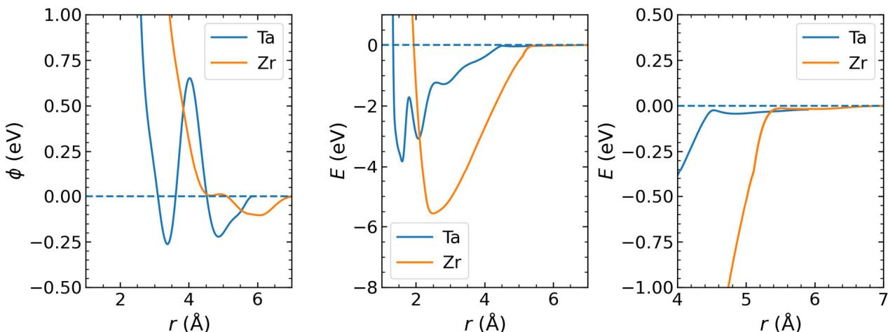  
Figure R1. Comparison of the EAM potentials of Ta and Zr. (left) The pair potential. (middle) The total energy, which is the sum of the pair energy and the embedding energy. (Right) A zoom-in of the middle panel to highlight the shallow well of Ta.

5. I understand that $Z \mathbf { r }$ actually exists in the hcp structure at ambient temperature and pressure, whereas bcc becomes the equilibrium crystal phase at higher temperatures. Perhaps this should be mentioned to avoid confusion.

R5. In response to the Reviewer's suggestion, we have added this point to the main text to ensure clarity and avoid any confusion. (see page 11)

# Detailed comments

1.Page3Third paragraph,line3-4.Alitlething: it wouldhelpthereadertospecify whichcooling rate was required to amorphize Ta in order to compare to the cooling rates that would be required for fcc/hcp. From the reference given I understand $\mathrm { R c } { = } 1 0 ^ { \wedge } 1 4$ for Ta, so the point seems to be that some even higher, albeit unknown rate is necessary for fcc/hcp.

R01. We thank the Reviewer for the comment on the critical cooling rates for BCC versus FCC/HCP metals. In the experiments, the critical cooling rate for Ta to form a glassy state is approximately $1 0 ^ { 1 4 } \mathrm { K / s } .$ , whereas this rate is insufficient to vitrify FCC and HCP metals. Therefore, FCC and HCP metals would require an even higher cooling rate, though the exact value remains unknown. We have added more details on this topic in the revised manuscript to provide further clarification. (see page 3)

2. Page 4 ICO is a non-standard kind of abbreviation. It resembles an acronym but it is simply an abbreviation of icosahedron.[Though elsewhere it is stated to be an abbreviation for "icosahedral order", so there are inconsistent definitions]. I do not recommend abbreviating a single word (icosahedron/-a) like this. If the authors wish to save space then I suggest using IO to standard for icosahedral order and rewording the text where possible to replace references to icosahedra with references to icosahedral order, which can then be writen as IO [and write out the word icosahedra in full where it cannot be replaced with icosahedral order].

R02. We apologize for the inconsistency in the use of abbreviations for icosahedra and icosahedral order. Following the Reviewer's suggestion, we have removed the abbreviations from the main text and replaced them with the fullterms to ensure clarity and avoid confusion. The abbreviations are now only used in the figures,and their meanings are provided in the corresponding figure captions. (see revisions throughout the manuscript)

3. Page 4, third paragraph. The sentence starting "For the lattr, experiments.." is rather unclear and should be reformulated.For one thing it was unclear what "latter" refers to.I figured it out on my second reading of the paper, when I realized that it must be referring to the first sentence of the paragraph, and latter must refer to alloys, since the seoncd sentence mentions former, refering to pure metals. But two more sentences appear before "later" so the reader is lost by then. Note that it is not just the word "later": the remainder of the sentence is also unclear.

R03.We thank the Reviewer forthe helpful suggestion to clarify the unclear statement. In response, we have replaced the terms "former" and "latter" with specific references to improve clarity. Additionally, we have expanded the discussion following this sentence to introduce more detailed information on the alloy experimental findings. (see page 5)

Page 5

4. Figure la does not communicate anything useful so I would suggest omiting it. I would almost say the same is true of 1b, though it seems perhaps to be necessary for comparison with 1(i).

R04_1. We appreciate the Reviewer's advice to omit panels a and b in Figure 1. Following this suggestion, we have removed these panels, which not only clarifies the figure but also allows us to save space in both the figure and its caption. (see page 9)

4. Little information or explanation is given about the beta and A15 phases.For example how many atoms are in the unit cells of these structures? On page it is mentioned that the $\mathrm { g ( r ) }$ for betaTa has "some disorder effects"--how can this be, if an ordered structure was used? According to ref 34 there are (only) 22 atoms in the unit cell for beta Ta, so it seems strange that the RDF includes so many more peaks.

R04_2. We followed the Materials Project database to investigate the perfect ordered structures of the $\sigma$ QCMP ( $\beta$ -Ta) and A15-QCMP phase. For $\sigma$ QCMP, we used the structure from Ta (mp42,https://next-gen.materialsproject.org/materials/mp-42). The lattice system is tetragonal, with 30 atoms in the unit cel (see Fig. R2). This structure differs significantly from simple crystals. We calculated the radial distribution function (RDF) of the unit cel with a pair distance resolution of 0.01 A (Fig. R2, corresponding to Fig.la in the revised manuscript). Several distinct peaks are observed in the first coordination shell, indicating the complex nature of $\sigma$ QCMP.We believe this reflects the hierarchical nature of its microstructure and refer to this as “some disorder effects" in the manuscript.

For the A15 structure， we used data from tungsten W (mp-11334， https://nextgen.materialsproject.org/materials/mp-11334). The latice system is cubic, with 8 atoms in the unit cell(see Fig. R3). This structure is simpler than $\sigma$ QCMP,as seen in its RDF (Fig. R3). To develop a suitable order parameter to characterize these structures in larger simulation systems, we replicated the unit cellin three dimensions and conducted thorough analyses, as discussed in Figure 1 of the main text and the associated sections.

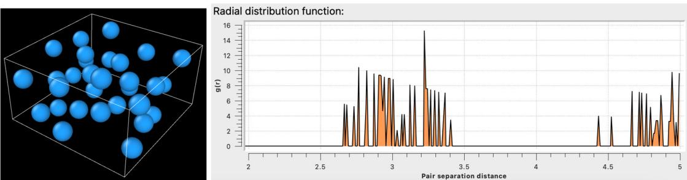  
We have added more details about $\sigma$ QCMP and A15-QCMP to the revised manuscript.(see page 8)   
Figure R2. The unit celland its coresponding radial distribution function for the beta phase.

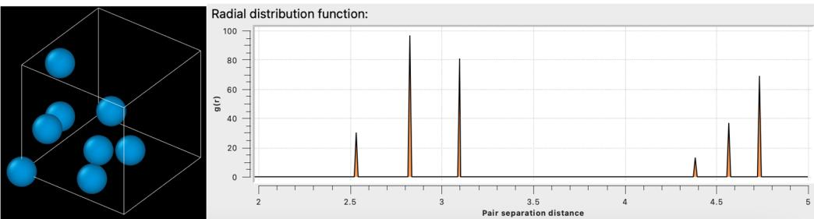  
Figure R3. The unit cell and its corresponding radial distribution function for the A15 phase.

5.Page 6 It is not clear how the authors chose their values s $\scriptstyle 0 = 0 . 7$ and $\mathrm { s } \_ 6 > 1 0$ to identify bcclike local environments. There should be a reference given, or arguments justifying these choice (in the suplemental material, perhaps).

R05.We thank the Reviewer for the helpful suggestion to include the relevant references. In response, we have added the references to the method applied in Russo & Tanaka (Sci. Rep. 2, 505 (2012)), which was first introduced by ten Wolde and Frenkel et al. (J. Chem. Phys 104, 9932 (1996))[see Fig. 2 there as an example]. We also reference our previous works where this method was employed: Hu & Tanaka, Sci. Adv. 6, eabd2928 (2020) and Nat. Commun. 13, 4519 (2022). These references are now included in the revised manuscript. (see page 7)

6. Similarly for the use of s_12 and its corresponding values 0.45 and 50. A reference to Keys+Glotzer 2007 is given, but how do the authors know that their QC phase is similar to that of Keys and Glotzer?

R06. In our simulations of Ta, both $\sigma$ QCMP and A15-QCMP can appear during the ordering process. By replicating the unit cells shown in Fig. R2 and R3 to a larger scale, we observed that the resulting structures resemble the $\sigma$ and A15 quasi-crystalline approximants presented in Fig. 1b in Keys & Glozter (PRL 99, 235503 (2007)) [also see Fig. R4 below]. All these are singlecomponent systems.Therefore, we adopted the method used by Keys & Glotzer and identified the corresponding order parameter, along with the associated parameters, to characterize these structures.We have added further discussion on this topic in the revised manuscript to provide more context and clarity. (see page 8)

7. "..where qlm(i) represents the spherical harmonics of particle i with respect to its predefined neighbors". Predefined how/when? If you start from a liquid phase you don't know which atoms a given atom will have as neighbors at a later stage. Instead of "spherical harmonics of particle i with respect to its .. neighbors", I would write "mean of spherical harmonics evaluated at the angular position of particle wrt...." CHECK

R07. We thank the Reviewer for helping to eliminate any potential misunderstandings. Following the Reviewer's suggestion， we have revised the statement to the following:“where $q _ { l m } ( i )$ represents the mean of the spherical harmonics evaluated at the angular position of particle $i$ with respect to its instantaneous neighbours in the thermal state. These neighbours are defined in three different ways to efficiently calculate the different order parameters to characterize BCC, QCMP, and local icosahedral orderings (see Methods for details)."(see page 7)

8. The term "sigma quasi-crystalline approximants" is not defined. It is new to me at least

R08.Quasicrystals exhibit a long-range aperiodic structure, and their approximants are complex, ordinary crystals whose local structural motifs can reproduce portions ofthe quasicrystal structure. We refer to sigma quasi-crystaline approximants as the σ phase, which serves as a periodic approximant to the underlying quasicrystal. Due to the metastable nature of the quasicrystalline phase and the extremely long simulation times required, we were unable to obtain a perfect quasicrystal in our study. Instead, we observed only special fragments of the quasicrystal. The two approximants observed in our study are the o phase and the A15 phase. These approximants have also been identified in the Dzugutov model， where they contribute to the formation of a dodecagonal quasicrystal [see Keys & Glozter,PRL 99,235503 (2007)]. For the Reviewer's convenience, we have reproduced an illustration of this model (Fig. R4). (see page 8)

# [REDACTED]

Figure R4. Dodecagonal quasicrystal (a) and its approximants (b) [reproduced from Keys & Glozter, PRL 99,235503 (2007)]

9. In the phrase "the solid bond numbers from s_12 for the... particles are ...",it's not clear to me whether the value of s_12 is what is meant by a "solid bond number". The definition of s_12 referred to it as a "solidity parameter". Is this the same as a "solid bond number"?

R09. We thank the Reviewer for pointing out the clarification regarding $s _ { 1 2 }$ . Indeed, the solidity parameter is essentially the same as the solid bond number.In Equation(1), we define the particlelevel $s _ { 1 2 }$ based on the bond properties between the central particle $i$ and each of its neighbours $j$ We use the threshold $s _ { 0 }$ to differentiate whether a $( i - j )$ bond is solid-like $( > s _ { 0 } )$ or liquid-like $( \le s _ { 0 } )$ . By running over all the neighbours, $s _ { 1 2 }$ counts the number of solid-like bonds. Hence, it is referred to as a “solidity parameter". We have added a more detailed discussion on this point in the manuscript to improve clarity and presentation. (see page 8)

10.The blue and cyan atoms in the beta structure are said to be "identified by the bond orientational order parameter w_6. It should be mentioned that the definition of w_6 and the numerical criterion are given in the methods section (though why not include the latter in the main text?)

R10. We thank the Reviewer for the helpful suggestion. In response, we have included these details in the main text. (see page 10)

11.Page 7,caption to Fig 1. Under part "e",I wonder whether "interesting" is an appropriate word here. For one thing it seems Vague-t's unclear what it is interesting. But a figure caption should as a general rule be purely descriptive, without commenting or interpreting--what is important here is to commnunicate what selection of particles these red and blue rectangles represent.

R11.We appreciate the Reviewer's suggestion to improve clarity. In response, we have removed the word “interesting”and panels f&g, and we have revised the caption to provide more detailed and descriptive information. The revised caption now better explains the spatial distribution of the centres of local icosahedral orderings,highlighting the simple layered packing of five-membered rectangular units, even though the overall $\sigma$ phase has a complex structure. (see page 9)

12.Page 8. The term Frank-Kasper bond is not defined [note also the incorrect spelling of Kasper]. It should be defined and an appropriate reference given (presumably Ref 41 which is first cited below).

R12.We thank the Reviewer for the helpful suggestion. In response, we have added the definition of a Frank-Kasper bond, as described by Pedersen et al. (ref. 48), where a neighbour pair is defined by six common neighbours. This definition， along with the appropriate reference, has been included in the revised manuscript to enhance clarity. (see page 10)

13. Third paragraph, first line ("Similarly, we examine the three-dimensional packing.."). Presumably the right panel ofFig 1h is referred to here, but this is not stated. It is mentioned that yellow atoms are replaced with red, but this is only true for some of them. What is the criterion for showing an atom in red?

R13.We thank the Reviewer for carefully reviewing our figure. The Reviewer is correct that this statement pertains to the right panel of the original Fig.1h. To improve clarity, we have replaced the yellow atoms on the white square in the left panel with red atoms for better illustration. We have added these details to the revised manuscript to ensure accuracy and clarity. (see page 10)

14.Regarding the bcc super-lattice of icosahedra shown in k, do the adjacent icosahedra share atoms?I mean, when adding the 12 neighbors compared to figure j, are some of the neighbors added the same, or are there are $8 ^ { * } ( 1 + 1 2 )$ atoms shown? (as best I can tell they are shared).

R14.As the Reviewer pointed out, the icosahedral clusters in panel g (previously panel k) will indeed share neighbours to form the BCC super-lattice of the A15 phase. We also note that there are only 81 atoms in panel g. To clarify this, we have added more details to the figure caption in the revised manuscript. (see page 9)

15.Page 9 "Nose temperature" should be explained. Not all readers should be expected to be familiar with TTT plots.

R15. The "nose temperature" of a Time-Temperature-Transformation (TTT) curve refers to the temperature at which the minimum time is required for a specific phase transformation to occur. To make this concept clearer for a broader readership, we have added this explanation in the revised manuscript. (see page 11)

16.In Fig 2 it seems to be implicit on first reading that the liquid willtransform entirely to a BCC phase or QCMP phase, and separate TTT plots are given for the different phases. But my reading of parts (c) and (d) is that the final configurations contain a mixture of different phases. Or is it that each configuratino ends up with only one phase, and the fraction given in (c)and (d) represent how many trajectories out of the ensemble ended up in a given phase? Please clarify.

R16.We apologize for the confusion and thank the Reviewer for bringing this to our attention. In Fig. 2, we present two sets of simulations. The first set involves thermal annealing at constant temperatures (panels a & b). In these simulations, we track the trajectory and analyse the fractions of different structures. The final product typically corresponds to either BCC or $\sigma \cdot$ QCMP, with A15-QCMP rarely coexisting. Based on the final phase, we classify the simulations to generate the TTT curves for BCC-Ta and QCMP of Ta, which are shown in panel (b).

The second set consists of cooling simulations at diferent cooling rates.Here, the structure of the low-temperature solids is analysed, leading to panels (c) and (d) for Ta and Zr, respectively. Due to the ultra-fast cooling process, different phases can nucleate and grow, resulting in a mixture of structures in the final product. These simulations provide a more direct estimation of the critical cooling rate.

We have added more detailed explanations of these simulations in the revised manuscript to improve clarity and understanding. (see pages 11-13)

17.Page 10, caption to Fig 2 d "Similar behavior observed for Zr as for Ta" $- > \mathrm { I }$ think the point here is not that the same behavior is observed (rather the opposite is true), but that the same analysis is shown in (d) for $Z \mathbf { r }$ as was shown in (c) for Ta.

R17. We have revised the statement as “d, Similar analysis for $Z \mathrm { r }$ as presented for Ta." (see page 12)

18.Page 11. The authors state that they "measured the thermodynamic diriving force ... for different ordered phases" and refer to reference 13 for details.But in that reference it is clear that an empirical estimate is made,based on the measured enthalpy of fusion. So the word "measured" might be overstating it a bit. I suggest using "estimated" instead,and perhaps mention here that it is an empirical estimate based on the measured enthalpy of fusion. I presume the fact that the estimated delta mu for A15-Ta in Fig 2b(inset) is slightly higher than that for bcc (the true equilibrium phase, which therefore should have the largest driving force) is an example of the error in this approximation.

R18. We thank the Reviewer for the insightful suggestion. Folowing the Reviewer's advice, we have rplaced "measured" with "estimated" and clarified that the thermodynamic driving force is an empirical estimate based on the measured enthalpy of fusion.

Inspired by the Reviewers’ suggestions， we recognized that for Ta, different phases do not necessary share the same melting temperature $T _ { m }$ due to their distinct structure features. To investigate this further， we conducted additional simulations by constructing liquid-solid coexistent configuration and relaxing them at a series of temperatures. When the interfaces remained stable or the system's potential energy showed minimal change，we identified the corresponding temperature as the $T _ { m }$ of the solid phase.

As shown in Fig. R5(a-c), the melting temperature for BCC, $\sigma$ QCMP and A15-QCMP of Ta is $3 2 5 5 \pm 5$ K, $2 9 8 5 \pm 5 \mathrm { K }$ and $2 9 5 0 \pm 5 \mathrm { K } ,$ respectively. The measured $T _ { m }$ for the BCC phase is very close to the previous study [Nature 512, 177 (2014)]. Clearly, the BCC phase has a higher

$T _ { m }$ than the other metastable phases. Based on this finding,we carried out simulations to recalculate the enthalpy of fusion at $T _ { m }$ for each phase. The enthalpy of the liquid and solid phases is shown in Fig. R5(d-f),respectively. The estimated enthalpy of fusion is $0 . 2 7 4 \pm 0 . 0 2 7 \ : \mathrm { e V / a t o n }$ 1 for BCC, $0 . 2 6 4 \pm 0 . 0 2 7 ~ \mathrm { e V }$ //atom for $\sigma$ -QCMP，and $0 . 2 6 8 \pm 0 . 0 2 8 ~ \mathrm { e V / a t }$ om for A15-QCMP, respectively. It is easy to find that the stable BCC phase has the largest enthalpy of fusion.

Figure R6 updates the comparison of the thermodynamic driving force of crystallization from the enthalpy of fusion for each phase. Only minor differences are observed, which is consistent with our previous analysis. The slightly higher thermodynamic driving force at the reduced temperature may originate from the lower melting temperatures of the metastable phases. Nevertheless, the assumption involved in this approximation may also bring some uncertainty/error, as realized by the Reviewer. Overall， the difference in the thermodynamic driving force is rather weak. Additionally, we note that from experiments or ab-initio calculations, the energy of the A15 phase is slightly higher than that of the BCC phase by approximately O.03 eV/atom for Ta (data source from the developer: https://sites.google.com/site/eampotentials/ta). Given that this difference is relatively small, it does not significantly affect the other analyses.

  
We have added this clarification and related discussion in the revised manuscript. (see pages 14. 15,33)   
Figure R5. Estimation of the melting temperature and the enthalpy of fusion for different phases of Ta.(a-c) are the time dependence of the potential energy of the liquid-solid coexistent configuration at various temperatures. (d-f) present the time evolution of the enthalpy of the liquid and solid phases at the measured melting temperature for each phase. In (a-c) and (d-f) the phases are BCC, $\sigma$ QCMP and A15-QCMP, respectively.

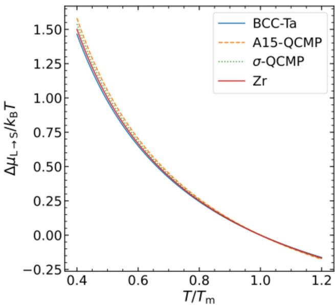  
Figure R6. The thermodynamic driving force of crystallization for different phases.

19.I cannot see where the expectation that the interface energy for the different phases compared to liquid are ordered according to l $_ { \textrm { \tiny A l S - T a > B C C - T a > } }$ beta-Ta comes from. It is apparently based on Fig. 2a, but Icannot see how (note that Fig 2a refers to QCMP but not beta-Ta or A15-Ta).

R19. We thank the Reviewer for pointing out the potential for confusion, which has helped us improve the clarity of the manuscript. The conjecture about the crystallization kinetics and structural characteristics is based on the observation that while the diffusion rates and thermodynamic driving forces for these phases are similar, the crystallization behaviors and structural properties can still vary significantly.

In more detail, when the undercooling is weak, the final product tends to be the σ phase QCMP (Fig. 2a), with the A15 phase being relatively rare compared to the BCC phase. This suggests that the o phase is the easiest to nucleate, while the A15 phase is the most difficult. Additionally, from the radial distribution function $g ( r )$ in the original Fig. lc, $\beta$ Ta (with $\sigma$ phase) exhibits a highly complicated local structure, showing the highest similarity to the liquid state among the three phases. In contrast, the A15 phase has a well-ordered structure similar to BCC, but with a more hierarchical arrangement, making it distinct from the liquid state.

We therefore anticipate that the A15 phase should have the largestliquid-crystal interfacial energy, while the σ phase should have the smallest. This reasoning leads to the anticipated values presented in the manuscript.

We have added the relevant details to the main text and updated the caption of Fig.2a to reflect these explanations. (see pages 12, 15-16)

20. Page 13 The quantity plotted in Fig 4b should be explained more clearly. As far as I can tell it counts all atoms identified as being at the centra of icosahedra,and their 12 neighbors (but without double counting). No actual cluster analysis has been made, but clustering is inferred by the fact that $6 0 \% < ( 1 + 1 2 ) \mathrm { x } 8 \%$ . In the caption the quantity is stated to be "the fraction of atoms involved in ICO clusters",but that would require an actual cluster analysis to exlude contributions from isolated icoshedra.

R20. We thank the Reviewer for pointing this out, which has helped improve the clarity of our explanation. The Reviewer is correct that in Fig. 4b, we count all the atoms identified as being at the centres of icosahedra along with their 12 neighbours, ensuring that double counting is excluded. This approach accounts for both isolated icosahedra and connected icosahedra, representing shortrange and medium-range orderings formed by icosahedra.

To address this, we have revised the figure caption to make this distinction clearer and ensure the explanation is unambiguous. (see page 17)

21. Page 14 It is stated that the BCC phase grows by consuming the beta-Ta QCMP,facilitated by the low interfacial energy, "enabling it to readily transform into either the liquid or the BCC phase". There are technically two different interfacial energies that are relevant here, namely those for (1) the interface between liquid and beta-Ta, and (2) the interface between bcc and beta-Ta. Are both low? How is this known? No quantitative estimates for interface energies have been given.[As far as I can tell the whole discussion about interface energies is based on the the supposition that that for liquid/beta-Ta must be low because it is hard to explain the prevalance of beta-Ta otherwise. But it has not been estimated quantitatively.]

R21. The Reviewer is correct that, in principle, two types of interfaces should exist, as noted. In our simulations, we observed that the transformation from $\beta$ -Ta ( $\sigma$ QCMP) to BCC-Ta does not occur directly. Instead, $\beta$ -Ta first transitions to the liquid state at the surface before becoming part of the BCC phase. This two-step process likely arises from the comparatively lower solid-liquid interfacial energy compared to the solid-solid interfacial energy.

Interestingly, a similar phenomenon was reported by Peng et al. (Nature Materials 14,101,(2015)) during solid-solid phase transitions in colloidal systems. This suggests that crystal growth kinetics under a two-phase coexistence configuration could be a promising area for future investigation.

We have added these observations and their implications to the revised manuscript for a more comprehensive discussion. (see page 19)

22.Page 15 (Figure 5 and its caption). The term "atom number of X" should be replaced with "number of atoms in X" (more than one place, search the manuscript).

R22. We appreciate the Reviewer's suggestion and have replaced instances of “atom number of $X ^ { \dag }$ with “number of atoms in X" throughout the manuscript to improve clarity and consistency. (see page 20 and throughout the manuscript)

23.I don't understand the quantities shown in Fig. 5(b). Neither the legend on the plot nor the caption are clear. It seems that "cluster attachment" means I should interpret the quantity plotted as the \*increase\* in atoms in QCMP, since a previous point in time, but which previous point is not clear ("its previous adjacent configuration"). Im also not sure how to interpret the fact that the blue and orange curves almost exactly coincide for times below about 500 ps.

R23.In Fig. 5b, we track the evolution of different phases by analysing a trajectory with snapshots recorded at an interval of 4 ps. Specifically, for each time $t _ { 0 }$ ， we compare the structure to the immediately preceding configuration at $t _ { 0 } - 4$ . The blue curve represents the number of atoms newly incorporated into the QCMP phase from $t _ { 0 } - 4$ to $t _ { 0 }$ ． Meanwhile, the orange curve measures how many of these newly added QCMP atoms were part of local icosahedral clusters in the earlier snapshot at $t _ { 0 } - 4$ ：

This comparison allows us to determine the origin of the crystalline atoms. The overlap between the blue and orange curves below approximately 500 ps reveals that the QCMP phase primarily grows from surrounding local icosahedral clusters during this period. This observation strongly supports the cluster attachment mechanism driving QCMP crystallization.

We have added these details to the revised manuscript to enhance clarity and understanding. (see pages 20-21)

24. Page 16 How can I see the weting by LiqICOs in Figs 5e,f?

R24. In Fig. 5e and f, we illustrate the local icosahedral orderings in the liquid state (LiqICOs) in two distinct visual forms, categorized based on their proximity to the growing O phase nucleus (represented by yellow atoms). One is distributed throughout the entire simulation space without considering their neighbouring configurations. The other is distributed on the surface of the nucleus, with the centre coloured purple and their neighbours coloured orange. We find that the nucleus is always encapsulated by this second type of LiqICOs, and it grows by “eating” these LiqICOs (see R23). Therefore, the nucleus is considered to be wetted by LiqICOs. We have incorporated these detailed explanations into the revised manuscript. (see page 21-22)

25.Page 17 "confirming the higher interfacial energy of A15-QCMP than beta-Ta QCMP". Again this is ambiguous since an interfacial energy is not associated with a single phase but with a pair of phases. My guess here is that the interface between each QCMP phase and the bcc phase is meant here,rather than between the QCMP phase and the liquid phase. Is this correct? This should be made more explicit. The same applies to the statement about interfacial energies 3-4 lines from the bottom of page 17.

R25.We are sorry for this ambiguity. As discussed in R21,our simulations reveal that a thin liquid layer forms at the interface between the BCC phase and the A15 phase, as shown in Fig. 5i. This liquid layer is notably thin, with minimal associated preordering for either the BCC or A15 phases, resulting in a pronounced structural gradient. Consequently, the BCC-A15 interface is relatively stable, and in our long-term simulations, no crystal growth occurs from either phase.

We hypothesize that any transformation between these phases would require mediation by an intermediate liquid phase to reduce the energy barrier, akin to the BCC-o phase transformation observed earlier. Therefore, in this context, the "interfacial energies" refer specifically to the liquid-A15 interfacial energy and the liquid-o interfacial energy.

Similarly, in Fig. $5 \mathrm { k } ,$ where two $\sigma$ -phase nuclei with different orientations meet, their growth is also mediated by an intermediate liquid phase. Here again, the interfacial energy primarily pertains to the liquid-o interfacial energy.

From these observations, we propose that the liquid-phase-mediated two-step crystallization mechanism may be a universal feature of solid-solid phase transformations. However, this hypothesis requires systematic future investigation. A recent study by Liang et al. (Phys. Rev. Mater.8, O33402, 2024) lends support to this idea, identifying the emergence of local disorder at the interface as critical for the A15-BCC phase transformation in tungsten.

We have added these details and the reference to the revised manuscript to enhance clarity and context. (see pages 23,24)

26.Page 20 In the second paragraph the authors write "We are not attempting to map our findings directly to real materials",apparently in the context of allys which are the subject of this paragraph, but I presume the authors would claim that their results say something (albeit with some uncertainty) about real Zr and Ta?

R26. In our study, we performed computer simulations with two empirical potentials for $Z \mathrm { r }$ and Ta. While these models, from their developers’ perspectives, capture certain properties of real materials, they are not accurate in allrespects. Therefore, these models cannot fully represent real materials in our understanding.However, we hope that these empirical models provide a pathway to understanding the fundamental physics of how and why glasses form in a simplified manner. Encouragingly, experimental findings by Zhong et al. (Nature 512,177 (2014)) show that Ta can form a glass while Zr cannot at a cooling rate of $1 0 ^ { 1 4 } \mathrm { K / s } ,$ which is qualitatively consistent with the glass-forming abilities predicted by these models. We thus hope our findings can reveal at least part of the physical mechanisms behind this experimental observation.

Additionally, in our previous computational study of TiAl alloys (Ref.18), we observed that altering the alloy composition affected the competition between crystallization and quasicrystallization,resulting in improved glass-forming ability. This suggests the existence ofa general underlying rule governing glass formation. We hope the insights gained from these simplified models can provide clues to understand experimental observations in similar conditions—for example, in multi-component systems with a significant presence of local icosahedral orderings.

We recognize, however, that the physical mechanisms in real materials are far more complex, with both topological and chemical orderings, as well as their couplings, playing key roles in determining material properties. We sincerely hope that more accurate empirical models will be developed by experts in the future, allowing us to make more definitive connections between simulations and real materials. Such advancements would be a significant step toward bridging the gap between computational studies and experimental findings.

We have added related discussions to the revised manuscript. (see page 27)

27.Page 22 (Methods section) I think the procedures for structural characterisation need to be elaborated on more. The description here is simply too terse: "We consider the nearest 14 particles to characterise BCC, the atoms within a cutoff distance of $7 . 7 \mathrm { \AA }$ to characterise QCMP, and the nearest 12 particles to charaterise ICO." Given an atom in the simulation, what exactly is the procedure for determining whether its environment is BCC, QCMP or icosahedral? Also, how is the cutoff $7 . 7 \mathrm { \AA }$ justified?

R27. In our structural analyses， the coexistence of multiple structural orderings makes it challenging to characterize them simultaneously. For example, a perfect local icosahedral ordering has 12 neighbours, a perfect BCC structure requires 14 neighbours, and the structures of the o and A15 phases extend over much longer ranges. To address this, we consider varying numbers of nearest neighbours to accurately characterize these structures using bond-orientational order parameters.

The cutoff distance of $7 . 7 \mathrm { ~ \AA ~ }$ for the QCMP phases is adapted from Keys & Glotzer (Phys. Rev. Lett. 99,235503,(2007)) with slight modifications.By testing different trial cutofs, we analysed the microstructures of the o and A15 phases (see Fig. 1) and found that a combination of $s _ { 6 }$ and $s _ { 1 2 }$ from equation (1) is sufficient to characterize the ordered local structures at this distance.

For each atom in the simulation, we first determine whether it belongs to the BCC or QCMP phase, as_these are mutually exclusive. We then assess whether it exhibits icosahedral ordering by calculating the order parameter $w _ { 6 }$

Additional details about this analysis procedure have been included in the Methods section to help readers follow the methodology more effectively. (see pages 31-32)

28. Page 30. Extended Data Fig 1. The quantity in (b) is not defined: what is "point pattern analysis"? The caption for (d) and (e) describes these plots as "density profiles" but I don't see that a density is involved (similarly in the caption fo Extended Data Fig 2).

R28. Point patern analysis is a methodology used to study the spatial arrangements of points in space. Specifically, by varying the cutoff distance to define a cluster, the number of clusters, $N _ { c l u s t e r }$ is derived. In Supplementary Fig. 4b, we plot the normalized $N _ { c l u s t e r }$ as a function of the cutoff distance.From this distribution we identify that the spatial organization oflocal icosahedral orderings in the liquid state does not follow a random pattern. We have updated the corresponding figure caption in the revised manuscript to reflect this clarification.

Regarding the term “density profiles”, it essentially refers to a counting analysis, similar to $g ( r )$ ， but weighted by a physical quantity. In panels (d) and (e), we bin the particle distances to the centre of mass of various nuclei and calculate the averaged order parameter $ { \langle w _ { 6 } \rangle }$ for each bin. While actual density is not involved, we describe this approach as constructing "density profiles" of $\left. w _ { 6 } \right.$ a term we use consistently elsewhere. Additional details have been included in the figure captions in the revised manuscript to clarify this usage. (see revised Supplementary Information)

Spelling/Grammar/Language

Abstract line2: "the simplicity" $_ { - > }$ "their simplicity"

Page 3 shortcut $_ { - > }$ short   
Page 8 Kapser $_ { - > }$ Kasper   
Page 11 controling- $>$ controlling   
Page 11 "about two times" $_ { - > }$ "about a factor of two"   
Page 12, caption to Fig 3 rage $\mathrm { . > }$ range   
Page 16 The word "elucidating"(7th line from bottom) seems out of place.Did the authors perhaps   
mean "enhancing" or "maintaining"?

R29. We sincerely thank the Reviewer for carefully checking these items. We have made the necessary corrections in accordance with the Reviewer's valuable suggestions. (see revisions throughout the manuscript)

We sincerely thank the Reviewer for providing many constructive and valuable comments, which have been extremely helpful in improving our manuscript. We hope that we have adequately addressed the Reviewer's comments and that the Reviewer will find that the revised manuscript is now suitable for publication in Nature Communications.

# Response to the comments of Reviewer #2

The authors present a simulation study of Ta and $Z \mathbf { r }$ crystallization. The study is very detailed and rigorous,and it has, undoubtfully, scientific value. Nevertheless,we do not see enough novel physical concepts or phenomena to deserve publication in Nature Communications.

R1. Firstly, we would like to express our sincere gratitude to the Reviewer for carefully reviewing our manuscript and providing valuable feedback that has helped improve the quality of our paper. We appreciate the Reviewer's recognition of the detailed and rigorous nature of our study, which undoubtedly holds scientific value. However, we respectfully disagree with the Reviewer's observation that our paper lacks novel physical concepts or phenomena. Below, we explain why we believe this is not the case.

In our work, we primarily focus on the physical factors that drive the contrasting glass-forming abilities of two transition metals, motivated by recent experimental findings by Zhong et al. (Nature 512, 177, (2014))， our previous research (refs. 13-18), and related studies by other researchers. We believe that our findings are of significant importance for the following four reasons:

1) Glass-forming ability (GFA) refers to how easily a material can be vitrified, which determines the maximum size of the amorphous sample that can be produced in experiments. The field of metallic glasses began with the discovery of the first amorphous alloy, the Au-Si binary system, by Duwez et al. (Nature 187, 869 (1960)). Since then, progress has largely been driven by the discovery of new metallic glasses with larger sizes, culminating in the development of bulk metallc glasses. These advances have primarily relied on trial-and-error experiments to identify new alloy systems with enhanced GFA. However, the fundamental physical origin of GFA remains mysterious. This lack of understanding is a major constraint on the experimental fabrication of new bulk metallic glasses, a problem that has persisted in the field.

In recent decades, bulk metallic glasses have mostly been found in multi-component systems, which complicates the identification of the origin of GFA due to the large number of control parameters involved. These parameters include topological order, chemical order， and their interactions (Hu & Tanaka, Sci. Adv. 6, eabd2928 (2020)). While some empirical rules have been proposed based on the properties of fabricated metallic glasses, they lack predictive power. To address this complex issue, we need to simplify it into a solvable form, taking a bottom-up approach. Based on our previous work (Hu & Tanaka, Sci. Adv. 6, eabd2928 (2020)), we found that local chemical ordering on top oflocal topological ordering plays a crucial role. However, the independent role of local topological ordering was not clear. This is why we turned to monatomic metals, where chemical ordering is absent, making it easier to define local topological ordering in a single-component system. Through this approach， we discovered that the balance between competing orderings is critical to GFA, and the competition between crystallization and quasicrystallization facilitates glass formation. This represents a novel contribution to the field and provides valuable insights that may also be applicable to other areas of study.

2) The question of whether human beings can vitrify single-component systems is a fundamental one. It suggests that glass-forming ability (GFA） could be measurable for any material on Earth through the critical cooling rate, and it may also imply that the disordered state is a fundamental state for any materials, provided that the cooling rate is sufficiently fast. This is of great significance for advancing our understanding of natural science. Considerable efforts in literature over the past few decades have attempted to address this. For instance, the monatomic metal germanium (Ge) was vitrified by Angell et al. (Nature 448, 787 (2007)) under high pressure for a smallsample. While the origin of this phenomenon remains unclear, it is likely different from transition metals due to the involvement of directional bonding. Subsequently, Zhong et al. (Nature 512,177 (2014))demonstrated the vitrification of some BCC metals at an effective cooling rate of $1 0 ^ { 1 4 } \mathrm { K / s }$ , while FCC and HCP metals did not exhibit similar behaviour. More recently, Wang et al. (Nat. Mater. 23,1193 (2024)) reported the vitrification ofFCC metals through rapid deposition, highlighting the importance of icosahedral-like topological orderings.Despite these advances, the physical mechanisms behind glass formation in monatomic metals remain elusive, largely due to the difficulty in tracking particle-level information. Exploring these mechanisms is crucial. Furthermore, understanding the GFA of monatomic metals can offer important insights into the fundamental three-dimensional atomic packing structures of glasses, as seen in studies such as Miao et al. (Nature 592, 60, 2021) on high-entropy alloys with similar metallic radii, and in the work of Nat. Mater. 21, 95 (2022) on single-component metals.

3) The discovery of quasicrystals has significantly enriched crystallographic studies, earning Prof. Shechtman the Nobel Prize in 2O11. Since then, various types of quasicrystals have been synthesized, and their microstructures have been extensively studied. However, the structural mechanism underlying quasicrystallization remains elusive. One notable contribution by Keys & Glozter (PRL 99, 235503， 2007） proposed that dodecagonal quasicrystals form through the assimilation of stable icosahedral clusters.Despite this, the crystallization kinetics of quasicrystals in supercooled liquids and their competition with regular crystals are still not well understood. Our study provides answers to these fundamental questions, shedding light on the conditions under which quasicrystals can form. We emphasize the hierarchical nature of particle rearrangements during quasicrystallization. These findings may offer a new perspective on understanding the physical properties of quasicrystals.

4) The above discussion has primarily focused on the field of metallic glasses, where we can conclude that both transition metals and metalloid-like single-component systems are capable of vitrification. However, this scope can be broadened to other fields where the origin of glassforming ability in monatomic metals remains unclear or has been overlooked. A prime example is antimony (Sb), a single-component phase change material identified by Salinga et al. (Nat. Mater. 17, 681(2018))[ref.4]. Its ability to rapidly switch between amorphous and crystalline states holds great potential for information storage. Another example involves the vitrification of active metals such as lithium (Li) and sodium (Na) through electrochemical deposition, which is crucial for the development of high-performance batteries (Wang et al. Nat. Mater. 19, 1339 (2020)). Both of these cases are of significant technological importance, but the structural mechanisms governing their crystallization kinetics and glass-forming ability are yet to be fully understood. We believe that our current study provides important insights that could advance the understanding of the glass-forming ability in these monatomic metals, ofering an exciting direction for future research to expand upon our findings.

With these expanded discussons, we believe that the contributions of our work are significant enough to meet the scope and criteria of Nature Communications. We have included the relevant discussions in the revised manuscript. We sincerely hope that the Reviewer will reconsider our work and provide any further constructive suggestions to help improve the manuscript, if applicable. (see pages 4-7, 29)

The authors claim as main result that the analysis of the simulations unveil a non-classical crystallization pathway. This means that the formation of a critical nuclei cannot be visualized as a well-defined crystalline region surrounded by the metastable liquid phase, as simplified in the classical nucleation theory,but it is in reality the outcome of complex order-disorder fluctuations with a diffuse boundary between crystalline and liquid regions. The interface between the two phases is not a thin layer transitioning brusquely from crystalline to liquid structures, but a complex multilayer structure involving changes in the liquid local ordering near the interface. This is not a new result per se,as it is a conception of crystalline nuclei formation that has been previously found, described and discussed in diferent systems. Some of the most interesting ones published by the same authors in refs. 12 and 13 of the paper.

R2. We agree with the Reviewer that part of the story regarding the non-classical crystallization pathway involves the gradual structural transition from the crystal nucleus to the liquid phase, mediated by preordering. The thickness of this preordering layer depends on the material, as shown in our previous studies (Hu & Tanaka, Sci. Adv. 6, eabd2928 (2020) [ref.13] and Nat. Commun. 13, 4519 (2022) [ref. 14]), and is also reproduced in our current study.

However,our main findings in this work differ. We identify the crucial role ofbalanced competing orderings in facilitating easier glass formation in Ta compared to Zr. In Ta, both crystalization towards the BCC phase and quasi-rystallization towards the $\sigma / \mathrm { A } 1 5$ phase are observed, competing with each other in the supercooled state. These processes are non-classical in distinct ways.

For crystallization towards the BCC phase, the non-classical pathway is marked by transient BCClike bond-orientational orderings at the particle level, both in the supercooled liquid and at the crystal nucleus surface. In the case of quasi-crystallization towards the $\sigma / \mathrm { A l } 5$ phase, the nonclassical pathway is characterized by transient local icosahedral orderings at the cluster level, occurring in both the supercooled liquid and at the nucleus surface. These two processes compete during solidification, and whichever wins diminishes the glass-forming ability. In contrast, in $Z \mathbf { r }$ crystallization occurs solely through the former pathway， with no quasi-crystallization. The preordering layer in Zr is much thicker than in Ta, resulting in weak frustration towards BCC phase formation, so crystallization easily dominates the solidification process. These findings explain the contrasting glass-forming abilities of the two systems and provide insight into the microscopic mechanisms by which local topological orderings influence glass formation—an understanding that has long been sought in the field.

# We have added the related discussion in the revised manuscript. (see pages 25-6)

The authors also claim that the competence between different crystalline structures is the origin of glass formation. This is also a well-known concept in the study of metallic glass formation. The structural distance or incompatibility between the liquid and the crystal, both in topological and chemical ordering,is one of the main factors that are commonly considered to promote glass formation. The idea that a complex atomic-scale reorganization for transitioning from liquid to crystalline structures is associated to a better glass-forming ability is, in our opinion, a rather classical view [A. Inoue et al., Glass Forming Ability of Alloys, J. Non-Crystalline Solids,1993; Y. Waseda, On the glass forming ability of liquid alloys, Science and Technology of Advanced Materials, 2008； J.F.Loffler, Metallic Glasses, Bulk,Encyclopedia of Materials: Science and Technology，2003；A.L. Greer, Metallic glasses...on the threshold， Materials Today，2009]. Another highlighted result of the paper is that the study clarifies the role of icosahedral structures (ICOs) in glass formation, and that this can be extrapolated to understanding glass formation in binary and multicomponent systems. However, the presence of icosahedral ordering in liquids and its association to glass forming ability is a well-established idea since the beginning of the field [Kelton et al., First X-Ray Scattering Studies on Electrostatically Levitated Metallic Liquids: Demonstrated Influence ofLocal Icosahedral Order on the Nucleation Barrier, Phys.Rev.Lett. 90, 195504,2Oo3]. This again is related to the difference between liquid and crystal structures, which favors or hinders nucleation. The structural evolutions presented in the paper for Ta and Zr seem very specific to these systems and we do not see how they change the general view of the role of ICOs in metallic glass formation.

R3. We thank the Reviewer for bringing these classical works to our attention and for providing valuable comments based on these previous studies. On the one hand, we agree with the Reviewer that several concepts regarding competition between different crystalline structures have been proposed, and their relationships with glas-forming ability have been discussed in earlier studies. We acknowledge that these works have provided important experimental and theoretical insights into understanding glass formation. However, these discussions are typically conceptual or qualitative in nature. Quantitative studies on crystallization kinetics and microscopic pathways at the particle level are rare, and the underlying dynamical and structural processes remain elusive, with such insights only being accessible through computer simulations to date.

On the other hand, the seminal experimental work by Kelton et al. (PRL 90,195504 (2003)) reported the detection of local icosahedral structures in supercooled liquids prone to forming icosahedral quasicrystals. They observed that the nucleation barrier was lowered by reduced interfacial energy due to the enhanced icosahedral short-range order as undercooling increased. This finding aligns with our results, where we show that quasi-crystalline nuclei can be wetted by surrounding local icosahedral orderings, thereby reducing the structural gradient at the interface. However， this microscopic mechanism was not recognized in their experimental work. Additionally, they did not demonstrate that local icosahedral orderings can stabilize the liquid against crystallization, favouring glass formation as observed by Tang & Harrowell (Nat. Mater. 12, 507 (2O13)). Their study did not explore the link between local icosahedral order and glassforming ability, which is a key aspect of our findings.We would like to emphasize that we do not intend to criticize the pioneering work of Kelton et al., but rather to highlight the novelty of our findings in comparison to these classical studies. Our aim is to underscore how our approach and insights provide additional depth, particularly in understanding the role of local icosahedral orderings in stabilizing the liquid state and promoting glass formation—an aspect that is challenging to explore through experimental studies.

Our conceptual difference lies in the crucial role of competing ordering effects in determining the fate of a liquid—whether it undergoes crystallization or vitrification. For example, in our study, we find that competition among crystal-like orderings alone is insufficient to drive glass formation. However, the competition between crystallization and quasi-crystallization plays a significant role in facilitating glass formation. If crystallization prevails, the liquid tends to form a BCC structure, while if quasi-crystallization wins, the liquid tends to form the o/A15 phase. Both processes independently lead to limited critical cooling rates.Moreover, an excess of local icosahedral ordering can also undermine the glas-forming ability, a fact that has been overlooked in many previous studies. In essence, the balanced competition between these orderings is critical for glass formation. Additionally,the distinct non-classical crystallization pathways involved have not been fully revealed in prior work.

The physical mechanism revealed in this study for Ta and Zr is not unique to these systems. In our previous work (Hu et al., Phys.Rev. Mater. 4, 105602 (2020)) [ref.18], we compared the binary alloys NiCu and TiAl, as well as binary patchy particle models, and observed the influence of competing crystallization and quasi-crystallzation on glass-forming ability. However， the presence oflocal chemical ordering complicates these systems.Furthermore, the studies by Kelton et al. (PRL 90,195504 (2003)) [ref. 28] and Kurtuldu et al. (PNAS 115, 6123 (2018)) [ref. 35] provide important support for the physical mechanism of quasi-crystallization identified in our work. These previous studies primarily focus on either crystallization or quasi-crystallization in relation to glass formation, whereas we present a unified discussion of both processes using Ta and Zr as model systems. Our findings offer insights that could help us understand more complex alloy systems. Thus, we aim to provide a more comprehensive perspective on the classical question of the role of local icosahedral ordering in glass formation. We hope that our work will be appreciated by the scientific community.

We have added more related discussions and appropriately cited the aforementioned works in the revised manuscript. (see pages 26, 27)

Therefore, the novel results reported in this paper are, in our view, very particular of the studied interatomic potentials. Each interatomic potential will lead to different driving forces for crystallization and different interfacial or mismatch energies between the liquid and crystalline structures, leading to different crystallization pathways and, eventually, different critical cooling rates for glass formation. From this study, we cannot see new universal features that may help to gain general knowledge on the origins of glass forming ability. In addition, the study is solely based on simulation, thus completely dependent on the models of interatomic potentials that were selected,and is not directly related to tackle the problems of any specific technological or experimental process.

R4. We respectfully disagree with the Reviewer regarding the novelty of the results presented in this paper. We apologize for reintroducing some of the discussions from the above responses in order to provide further clarification and explanation.

In our study, we find that the competition among crystal-like orderings alone is insufficient to drive glass formation, while the competition between crystallization and quasi-crystallization plays a crucial role in promoting glass formation. Using $Z \mathbf { r }$ and Ta as model systems, we observe that if crystallization prevails, the liquid solidifies into a BCC structure; if quasi-crystallization dominates, the resulting structure is the $\sigma / \mathrm { A } 1 5$ phase. Both pathways lead to a limited critical cooling rate. The balanced competition between these pathways is key to glass formation. Furthermore， the different non-classical crystallization pathways uncovered in our study are crucial to understanding the underlying structural mechanisms.We believe that these are the main contributions of our work, which are not confined to the specific model systems used.

The physical mechanism revealed in this study, comparing Ta and $Z \mathrm { r } ,$ is not limited to these systems. In our previous Work (Hu et al., Phys. Rev. Mater. 4,105602 (2020) [ref.18]), we observed similar effects of competing crystallization and quasi-crystallization on glass-forming ability in binary alloys such as NiCu and TiAl, as well as in binary patchy particle models. Additionally, the discoveries by Kelton et al. (PRL 90, 195504 (2003) [ref. 30]) and by Kurtuldu et al. (PNAS 115, 6123 (2018) [ref.37]) provide valuable support for the physical mechanism of quasicrystallization identified in our current study. Our findings offer insights into the behaviour of more complex alloy systems, aiming to provide a more comprehensive understanding of the classical question regarding the role of local icosahedral orderings in glass formation.

Although our current study is based on computer simulations, which allow us to track the trajectory of each particle, we believe our findings should not be considered limited to specific model systems. As discussed above, our results have broader implications for both other model systems and experimental research. We hope our study provides meaningful insights to aid in the understanding of experimental observations. Further investigation of additional model systems and their relationship to real-world experimental systems willbe essential for advancing this field in the future.

# We have included additional related discussions in the revised manuscript. (see pages 26, 27)

We recognize, however, the quality and soundness of the work. Our recommendation is based on our assessment of significance and relevance of the results, which we consider to be limited. In addition to the general comments above, we detail below a list of more specific and technical comments which we think the authors should response in case the editorial decision was to accept publication.

R5. We greatly appreciate the Reviewer's positive assessment of the quality and soundness of our work. We thank the Reviewer once again for carefully reviewing our manuscript and providing constructive suggestions that have helped refine the work. Based on our detailed point-by-point responses above, we hope the Reviewer will reconsider the significance and relevance of our results. We will now address the following minor points in detail.

# Minor points:

In many discussions during the paper appear the concept of interfacial energy. The authors attribute the non-classical crystallization pathways to the effect of reduced interfacial energy between the liquid and certain phases.However, there is not any estimation of the interfacial energy between liquid Ta and liquid $Z \mathbf { r }$ and the corresponding crystalline phases (A15, beta, BCC, HCP, FCC), so the statement of ‘low interfacial energy’ seems rather a qualitative consideration. It seems obvious that a higher level of mismatch between liquid and crystalline structures will increase the interfacial energy, but at the same time the thickness of the interface willalso contribute. It is not clear from the structural analysis in the paper why a thicker (more diffuse) interface with low structural mismatch should produce a lower interfacial energy than an interface with high structural mismatch but thinner. From the highly detailed analysis presented in the work, we think it could be possible to clearly define which atoms belong to the interface and calculate the interfacial energies and support the discussion. Is there any reason why this quantitative approach is not performed?

R6.We thank the Reviewer for the nice summary about the interfacial energy in the liquid state and the suggestion to estimate the liquid-solid interfacial energy to support our analysis. Building on the work by Tanaka and co-workers [PRX 8, O21040 (2018)], equation (4) derived from the general Ginzburg-Landau theory demonstrates that the interfacial energy is proportional to the square of the structural order parameter gradient at the interface. This gradient decreases with increasing interfacial thickness and decreasing structural contrast. Consequently， a thicker interface with reduced structural mismatch leads to a smaller gradient, thereby lowering the interfacial eergy. We have incorporated this theoretical framework into the revised manuscript to further strengthen our analysis.

Accurate measurement of liquid-solid interfacial energy is challenging in both experiments and simulations, particularly when irregular ordered structures are involved. In this work, $\sigma$ QCMP and A15-QCMP present challenges; therefore, we thus infer their relative values indirectly in the original presentation. Using differences in glass-forming ability as a starting point, we observe that similar thermodynamic driving forces and diffusion rates suggest the primary distinction lies in the interfacial energy. Specifically, Zr, a poor glassformer, is associated with a low liquid-BCC interfacial energy, whereas Ta,a good glass-former, corresponds to a higher liquid-BCC interfacial energy.

In Ta, the appearance of o-QCMP and A15-QCMP, which have more complex structures, suggests variations in their respective interfacial energies. The $\sigma$ phase, characterized by a noisy $g ( r )$ ， exhibits a higher structural similarity to the liquid phase compared to the well-ordered A15 phase. This implies that the liquid-o interfacial energy is lower than the liquid-A15 interfacial energy. Furthermore, g-QCMP is the most likely to nucleate in a supercooled liquid, while A15 nucleation is comparatively rare. This also indicates that the liquid- $\sigma$ interfacial energy is lower than the liquid-BCC interfacial energy. Considering the hierarchical structure of the A15 phase，its interfacial energy is likely higher than that of the liquid-BCC interface.

The Reviewer suggests an effective approach to estimating the liquid-solid interfacial energy to support the above comparison. Following this suggestion, we characterized the atoms at different liquid-solid interfaces and estimate the corresponding interfacial energy. Inspired by the Reviewers’ suggestions, we also recognized that for Ta, different phases do not necessary share the same melting temperature $T _ { m }$ due to their distinct structure features. To investigate this further, we conducted additional simulations by constructing liquid-solid coexistent configuration and relaxing them at a series of temperatures. When the interfaces remained stable or the system's potential energy showed minimal change, we identified the corresponding temperature as the $T _ { m }$ of the solid phase.

As shown in Fig. R1(a-c), the melting temperatures for BCC, $\sigma$ QCMP and A15-QCMP of Ta are $3 2 5 5 \pm 5$ K, $2 9 8 5 \pm 5 \mathrm { K }$ and $2 9 5 0 \pm 5 \mathrm { K } ,$ respectively. Clearly, the BCC phase exhibits a much higher $T _ { m }$ than the other metastable phases. Based on this finding, we carried out simulations to re-calculate the enthalpy of fusion at $T _ { m }$ for each phase. The enthalpy of the liquid and solid phases are presented in Fig. R1(d-f), respectively. The estimated enthalpy of fusion values are $0 . 2 7 4 \pm$ 0.027 eV/atom for BCC, $0 . 2 6 4 \pm 0 . 0 2 7$ eV/atom for $\sigma$ QCMP, and $0 . 2 6 8 \pm 0 . 0 2 8$ eV/atom for A15-QCMP,respectively. For comparison, Fig.R2 shows similar results for the BCC phase of $Z \mathbf { r }$ where the melting point is determined to be $2 1 0 5 { \pm } 5 \mathrm { K } ,$ and the enthalpy of fusion is $0 . 1 8 0 \pm$ $0 . 0 1 5 \mathrm { e V } /$ atom. Notably, the measured $T _ { m }$ values for the BCC phase of Ta and $Z \mathbf { r }$ are very close to the previous studies [Nature 512, 177 (2014) & Phys. Rev. E 90, 052403 (2014)]. Figure R3 compares the thermodynamic driving force of crystallization from the enthalpy of fusion of each phase. Only minor differences are observed, which is consistent with our previous analysis.

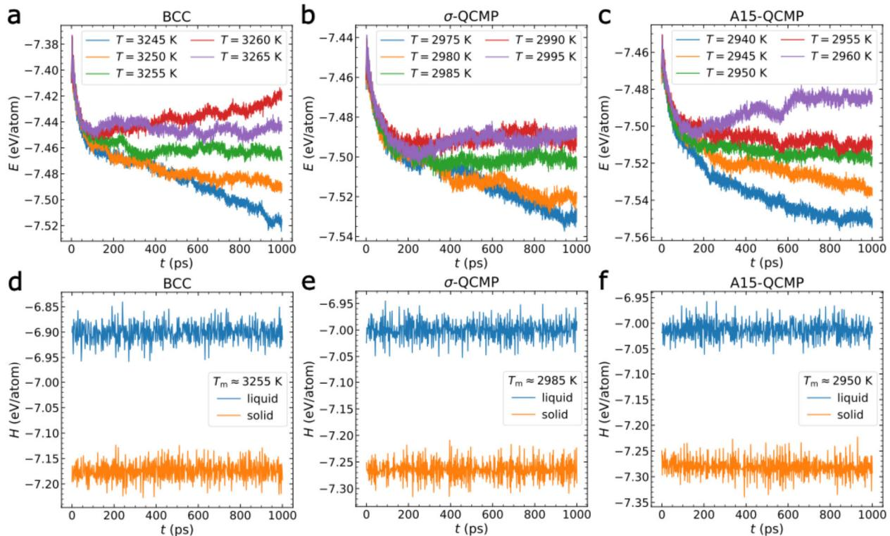  
Figure R1. Estimation of the melting temperature and the enthalpy of fusion for different phases of Ta.(a-c) are the time dependence of the potential energy of the liquid-solid coexistent configuration at various temperatures. (d-f) present the time evolution of the enthalpy of the liquid and solid phases at the measured melting temperature for each phase.In (a-c) and (d-f) the phases are BCC, $\sigma$ QCMP and A15-QCMP, respectively.

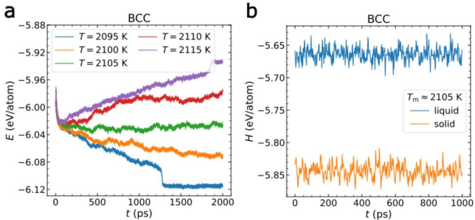  
Figure R2. Estimation of the melting temperature and the enthalpy of fusion for the BCC phase of Zr.

  
Figure R3. The thermodynamic driving force of crystallization for different phases.

We then estimated the liquid-solid interfacial energy by using the free energy perturbation method. In this protocol, we considered two different states at $T _ { m }$ $( A )$ the pure liquid phase, and $( B )$ the liquid-solid coexistent phase with planar interfaces. To ensure sufficient sampling, we conducted long-time simulations to collect the potential energy. The free energy difference $\Delta F$ is then estimated by

$$
\begin{array} { r } { \Delta F ( T _ { m } ) = - k _ { \mathrm { B } } T _ { m } \mathrm { l n } \langle \exp \left[ - \frac { \langle U _ { A } ( t ) \rangle - U _ { B } ( t ) } { k _ { \mathrm { B } } T _ { m } } \right] \rangle _ { A } , } \end{array}
$$

where $k _ { \mathrm { B } }$ is the Boltzmann's constant and $U _ { x }$ is the potential energy of a state $x$ at time $t$ ： $\langle \cdots \rangle$ represents ensemble average. As the two states have the same free energy at $T _ { m }$ , the additional free energy $\Delta F ( T _ { m } )$ arises from the formation of the interfaces.The interfacial energy is thus estimated from $\gamma ( T _ { m } ) = N _ { i } \Delta F ( T _ { m } ) / A _ { i }$ ，where $N _ { i }$ represents the number of atoms at the interfaces and $A _ { i }$ denotes the interfacial area. Given the distinct structural characteristics of different phases, we considered particle-level and cluster-level information for the BCC phase and the QCMP phases.

We visualized the interface meshes for these phases in Fig. R4. The estimated interfacial energy values $\gamma ( T _ { m } )$ are 1.182, 1.162, $1 . 4 9 5 ~ \mathrm { e V / n m } ^ { 2 }$ for BCC, $\sigma$ -QCMP and A15-QCMP of Ta. The BCC phase of Zr has a lower value of $0 . 5 4 2 ~ \mathrm { e V } / \mathrm { n m } ^ { 2 }$ . This comparison aligns well with the above analysis from the crystallization kinetics. Additional computational details are provided in the Methods section.

In addition, as seen in Fig. R4, an interesting feature emerges: the surface mesh of the BCC phase appears rugged， particularly for $Z \mathrm { r } .$ ，whereas the QCMP phase exhibits relatively rather flat interfaces. This distinction likely arises from their differing interfacial energies. The interface morphology observed here warrants further investigation in future studies.

We add the related results and discussion to the revised manuscript. (see pages 14-16, 33-34)

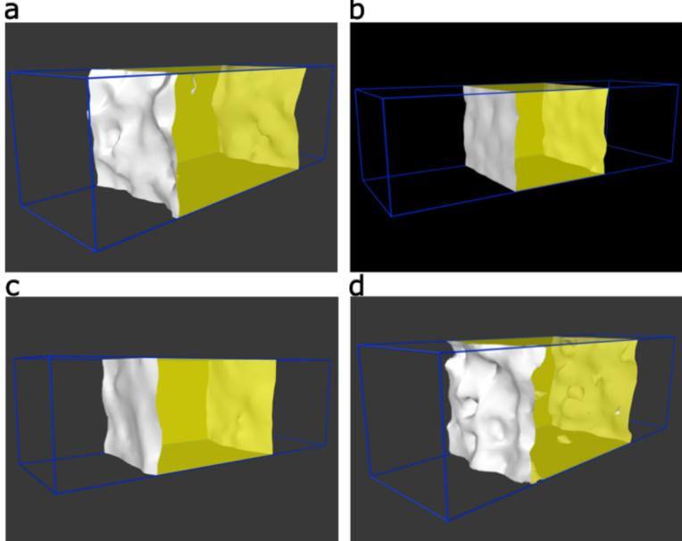  
Figure R4. Surface mesh of the solid phase in the liquid-solid coexistent configuration at $T _ { m }$ . (a) BCC of Ta; (b) $\sigma$ -QCMP of Ta; (c) A15-QCMP'of Ta; (d) BCC of $Z \mathrm { r }$ ，The gray surface demonstrates the liquid-solid interface, while the yellow region corresponds to the crystal phase. For better visualization, the liquid phase and all individual atoms are not shown.

Page 5: To deepen our understanding of these phases, we first analyse their microstructures ...'. In this sentence ‘microstructures’ should be changed by ‘structures',as we think the authors are referring to the crystal structure and not to any grain size or any other microstructural characteristic.

R7. We agree with the Reviewer's suggestion to replace“microstructures” with “structures” for greater precision. (see page 7)

Page 6:‘Through experimentation with perfect structures， we found that s12 effectively characterises both beta-Ta and A15-Ta, and is also capable of characterising BCC, unlike s6. Therefore, we combine s12 and s6 to effectively characterise QCMP.' In this sentence it is not clear how s12 and s6 are used to identify to which phase the atoms belong.Do the authors assign the atoms to BCC if both $\mathrm { s } 1 2 { > } 5 0$ and $\mathord { \mathrm { s } } 6 > 1 0$ while they assign the atoms to QCMP if $\mathrm { s } 1 2 { > } 5 0$ but

R8. We thank the Reviewer for the comment. From our analysis, we found the following: 1) $s _ { 6 } > 1 0$ is effective in identifying BCC particles but not other structures. Therefore, we only use $s _ { 6 } > 1 0$ exclusively to assign the atoms to the BCC phase.   
2) $s _ { 1 2 } > 5 0$ can identify particles belonging to the $\sigma$ phase，A15 phase，or BCC phase.To distinguish these, thus, we combine $s _ { 1 2 } > 5 0$ and $s _ { 6 } \leq 1 0$ to assign the atoms to the QCMP (σ/A15 phase).

We have added more detailed explanations to the Methods section in the revised manuscript to address this potential source of confusion. (see pages 8-9, 32)

Figure 2a: The authors should specify how this probability is computed. Do they run 30 simulations at each temperature and count which is the first phase nucleating in each run? Do they compute the number of nuclei corresponding to each phase? Do they compute the fraction of atoms in each phase?

R9. We apologize for the lack of clarity. In Fig. 2a, we conducted 30 independent simulations at each temperature and grouped the trajectories based on their final product (BCC or QCMP). The fractions of trajectories resulting in each final phase were then calculated and presented as probabilities in Fig. 2a. We have added these details to the revised manuscript to address this source of confusion. (see page 11)

Figure 2b: The authors should specify how they define the nucleation time. Do they decide that a nucleus has appeared when a certain number of atoms in a region are assigned to belong to a certain phase? What is the critical size to determine nuclei have been formed?

R10. The Reviewer is correct that the nucleation time is determined as the timescale at which the fraction of atoms in the ordered phase reaches $5 \%$ . We tested different threshold percentages and confirmed the results remain consistent. In our study, we performed simulations with $N = 1 6 0 0 0$ atoms at relatively low temperatures $( 0 . 4 7 5 \leq T / T _ { m } \leq 0 . 6 5 0 )$ , where a $5 \%$ threshold is sufficient for characterization. This approach aligns with prior work, such as the study on $Z \mathbf { r }$ by $\mathrm { H u }$ and Tanaka (Sci. Adv. 6, eabd2928,2020).

We have included additional details in the revised manuscript to address this point. (see pages 12- 13)

Figures 2c and 2d: In subfigure c legend, ‘Total' should be changed by ‘Crystal'?

R11. We thank the Reviewer for carefully checking our subplots. We have made the necessary corrections in the revised manuscript. (see page 12)

Page 12: ‘.. we anticipate the interfacial energy for undercooled Ta to follow the order A15-Ta $>$ BCC-Ta $>$ beta-Ta. This aligns with the observations in Fig. 2a...’ In Fig.2a only BCC and QCMP crystallization probabilities are compared, why the authors anticipate that the interfacial energy of A15-Ta should be larger than that ofbeta-Ta? If the authors are able to differentiate the probability of A15 and beta nucleation they should give this information somewhere.

R12. We apologize for the lack of clarity. In Fig.2a, we performed 30 independent simulations at each temperature and grouped the trajectories based on the final product (BCC or QCMP) without distinguishing between the $\sigma$ phase and the A15 phase within the QCMP category. From the trajectory analysis, we found that for QCMP, the product is predominantly the o phase, with the A15 phase being a relatively rare outcome. This suggests that the liquid-A15 interfacial energy is likely higher than the liquid-o interfacial energy. We inadvertently overlooked mentioning this point in the original manuscript, but we have added this finding to the revised figure caption and manuscript. (see pages 11-12)

Page 13: ‘These results suggest that medium-range orderings formed by ICOs impede crystallisation by increasing the interfacial energy of BCC nucleation. Notably， since the crystallzation kinetics are similar between BCC and QCMP of Ta (see Fig. 2b), ICOs may instead reduce the interfacial energy of QCMP nucleation (further discussed below).’ The driving force and the nucleation rate are the same for BCC and QCMP crystallization in Ta. In the framework of the classical nucleation theory, why the interfacial energy should be reduced for the QCMP?

R13.We thank the Reviewer for the question. As for the BCC phase, the crystallization kinetics in Ta is much slower than in Zr, despite similar thermodynamic driving forces and diffusion rates. This suggests that the liquid-BCC interfacial energy in Ta is significantly higher, likely due to the medium-range and short-range icosahedral ordering in the supercooled liquids. In contrast, the local icosahedral order in $Z \mathrm { r }$ is generally limited to short-range interactions. Given that the QCMP phases have a much more complex structure than the BCC phase in Ta, it is expected that higher free energy barriers would arise for QCMP nucleation. This is because more atoms must undergo specific spatial reorganization to achieve the required ordering,resulting in a significant entropy loss.

However, in our simulations, we observe that the σ phase nucleates more readily at lower undercoolings and becomes more comparable with the BCC phase at deeper undercoolings. In contrast, the A15 phase is either rare or much harder to nucleate (Fig. 2a). This indicates that the nucleation barrier for the o phase is lower than that of the BCC phase (also see the TTT curves in Fig. 2b),and even lower than that of the A15 phase. As shown in Fig. 3b, the thermodynamic driving forces for the phases are similar. This suggests that the liquid-o interfacial energy is the lowest among these phases.

The reduction in interfacial energy between the liquid and the complex hierarchical structure can only occur through a weting effect from the surrounding local icosahedral order in the o phase nuclei. This helps to reduce the structural order parameter gradient across the interface. This is further supported by the structural ordering analysis in Fig. 5, where crystallization of the o phase is observed. In the original manuscript， we primarily referred to QCMP as the $\sigma$ phase but inadvertently omitted this explanation.

We have added further discussion and made the necessary corrections in the revised manuscript (see pages 15-16)

Page 17: Here, we emphasise that the non-classical crystallisation pathway of BCC differs from that of QCMP as it operates solely at the particle level.' Icannot see the evidences pointing to this conclusion. Both BCC and QCMP nuclei show a diffuse boundary, with prevalence of preBCC structures or liqICOs near the surface. What makes the authors conclude that BCC operates solely at particle level?

R14. In the supercooled liquid, the BCC nucleus is surrounded by PreBCC structures, while the QCMP nucleus (primarily observed for the σ phase)is enveloped by local icosahedral clusters.For BCC, the unit cell of the crystal structure is relatively simple, allowing for easy extension through the addition of individual particles.In contrast, for the QCMP phase, as observed in Fig. 5, nucleation and growth proceed by incorporating local icosahedral clusters, rather than simply adding individual particles. Therefore, we consider the BCC phase to operate on a particle level, while the QCMP phase operates on a cluster level.

We have added further discussion on this topic in the revised manuscript. (see page 22)

Page 17: ‘This explains why beta-Ta QCMP nucleates more frequently despite A15-QCMP ..." All the results in the figures show the crystallization of QCMP (counting together beta and A15 phases). Where is the evidence showing that the beta phase nucleates more frequently than the A15 phase?

R15. In our simulations at different temperatures,as shown in Fig. 2a-b, we found that the QCMP is predominantly the $\sigma$ phase ( $\beta$ -Ta),with the A15 phase being rather rare. Although the A15 phase is infrequent, we still chose to illustrate this case in Fig. 5i. We inadvertently neglected to mention this in the original manuscript, but have now included these details in the captions of both Fig. 2 and Fig. 5i. We thank the Reviewer for bringing this to our atention. (see pages 11-12, 20, 22)

Extended data Fig.1b: The authors should define beter what is Ncluster in the figure caption.

R16. We thank the Reviewer for the comment. $N _ { c l u s t e r }$ is defined as the number of clusters formed by the centres of local icosahedral orderings in the supercooled liquid, with a pair distance cutoff $r$ used to define the clusters. We have added this definition to the figure caption and updated the label in the plot in the revised Supplementary Information.

We sincerely thank the Reviewer for providing many constructive and valuable comments, which have been extremely helpful in improving our manuscript. We believe we have successfully clarified the novelty of our findings and addressed the Reviewer's comments thoroughly. We hope the Reviewer willfind the revised manuscript suitable for publication in Nature Communications.

# Response to the comments of Reviewer #3

The manuscript is concerned with molecular dynamics modeling of the solidification of elemental Zr and Ta systems, where Ta has much slower crystallization kinetics. The latter is connected to the formation of complex metastable phases containing icosahedral units, increasing the glasforming ability (this effect is sometimes called the “confusion principle", since the system cannot “decide” between competing crystallization paths). The subject matter is interesting and the simulations seem generally well performed, but I am missing some depth in the analysis.

R1. Firstly, we would like to express our gratitude to the Reviewer for carefully reviewing our manuscript and providing valuable comments that have significantly improved the quality of our paper. The Reviewer made an excellent summary of our work, and we appreciate the positive assessment of both the research subject and our simulations.Below, we provide additional details to further illustrate the depth of our analysis,and we hope these clarifications will assist the Reviewer in refining their assessment of the manuscript.

We agree with the Reviewer that the "confusion principle" proposed by Prof. Greer is one of the most successful frameworks for guiding and explaining metallic glass formation. As outlined in the classical works by Greer (Nature 366,303 (1993) and Science 267,1947 (1995)), the confusion principle is based on multi-component alloys, stating that "the more elements involved, the lower the chance that the alloy can select viable crystal structures, and the greater the chance of glass formation," and "the diverse components present, particularly their different sizes， inhibit crystallization."

However, we respectfully argue that while the confusion principle provides valuable insights into understanding the current findings, its underlying concepts are fundamentally diferent from the principles at play in our study.

On one hand, our research focuses on monatomic metals, where multi-component effects such as size mismatch and chemical ordering are absent. Our goal is to identify the minimal conditions that influence the glass-forming ability of metals. By starting with the simplest case, we establish a foundation from which we can progressively incorporate additional factors， such as size mismatch and chemical effects, to investigate the glass-forming ability of more complex alloys. This approach is necessary due to the inherently complicated nature of glass formation in multicomponent systems. Addressing this in a straightforward manner is currently unfeasible, and we believe it represents one of the major challenges impeding the rapid advancement of the field.

On the other hand, the confusion principle emphasizes the diffculty a system faces in deciding between competing crystallization paths. It considers crystalline phases from a high-level perspective, without delving into the specifics, particularly the local structural orderings. In contrast, our work highlights the concept of "frustration" and the competing ordering efects that influence the crystalization rate and, by extension, the glass-forming ability. This idea was proposed and discussed within the theoretical framework of the two-order-parameter model developed by Tanaka, one of the authors of this study.

In this model, while the global free energy minimum favours the crystal phase, the presence of certain transient local structural orderings significantly impacts phase transformations, depending on how these orderings relate to the stable phase. The role of local structural ordering Varies from case to case.

In our simulations, we find that in supercooled Zr, the number of independent local icosahedral orderings is limited, which does not cause significant frustration toward the formation of the BCC phase, as it is also always wetted by BCC-like pre-orderings. However, in supercooled Ta, both independent and connected icosahedra are favoured. Their emergence severely frustrates the nucleation of the BCC phase, as icosahedra have incompatible symmetry with it. The spatial connection of local icosahedral orderings creates the possibility for more complex ordered structures, such as the o and A15 phases. As the Reviewer recognized, these metastable phases contain icosahedral units, meaning that icosahedra do not create frustration for these phases; rather, they facilitate their formation. Conversely, BCC-like orderings create frustration for these phases.

This explains why the system, despite containing many more icosahedra, still has a relatively limited glass-forming ability.Furthermore, since the formation ofboth ordered phases (o and A15) reduces the glass-forming ability,the balanced competition between them is crucial for optimizing glass formation, as observed in Ta.

Thus,we present a valuable microscopic picture of the roles of local structural orderings at different length scales in crystallization and glass formation. While the concept of competing crystalline phases is central to the success of the confusion principle, the underlying balanced competing ordering effects are critical and should not be overlooked. Our analysis also provides additional insights into the physical mechanisms underlying the formation of quasicrystals, which may extend to other complex phases as well. In fact, the understanding of metallic glass and quasicrystal formation appears to be interconnected, offering new perspectives on the nature of metallic glasses.

We hope the Reviewer finds these explanations reasonable and agrees that the novelty of our findings warrants publication in Nature Communications. We have added additional related discussion in the revised manuscript to address the Reviewer's comments. (see pages 26-27)

# Technical comments:

\* The authors use EAM potentials to model $Z \mathbf { r }$ and Ta. The present work requires a good description of the free energies of the bcc,beta-Ta,A15,and liquid phases of the elements.Icannot find any verification of this in the manuscript.I believe that it would be important to verify how well the potentials reproduce the relative stability of the phases, which would affect e.g. melting point, transition temperatures, and thermodynamic driving force. It must be excluded that the different findings between Ta and $Z \mathbf { r }$ are artifacts of the potentials that were used.

R2.We thank the Reviewer for the helpful suggestion to strengthen our discussion. The EAM potentials we used were developed by experts in the field: Zr by Mendelev et al. (Philos. Mag. 89,

967 (2009))and Ta by Sheng et al. (Nature 512,177 (2014)). The developers conducted necessary benchmarks of these potentials using experimental data and/or DFT calculations.

In more detail, for Ta (htps://sites.google.com/site/eampotentials/ta), the energy differences $\Delta E$ (eV/atom) for the crystal structures are 0.06 and O.03 for $\beta$ -Ta and A15-Ta, respectively, with respect to BCC. These values are in good agreement with experimental or ab-initio calculation values. For Zr (htps://www.ctcms.nist.gov/potentials/entry/2009--Mendelev-M-I-Kramer-M-JOtt-R-T-et-al--Cu-Zr/2009--Mendelev-M-I--Cu- $\mathrm { Z r }$ -LAMMPS--iprl.html)， the stable phase is HCP, while BCC is the metastable high-temperature phase with a free energy difference of 0.0517 eV/atom, again consistent with experimental data on phase stability. The comparison of phase stability from these potentials are exemplified in Fig. R1 below for further reference.

Furthermore, experimental studies by Zhong & Sheng et al. (Nature 512,177 (2014)) demonstrate that Ta can be vitrified at the cooling rate $1 0 ^ { 1 4 } \mathrm { ~ K / s }$ ，while $Z \mathbf { r }$ cannot. This experimental result supports our simulation findings, indicating that Ta has better glass-forming ability than Zr.

We have added these details to the revised manuscript. (see page 30)

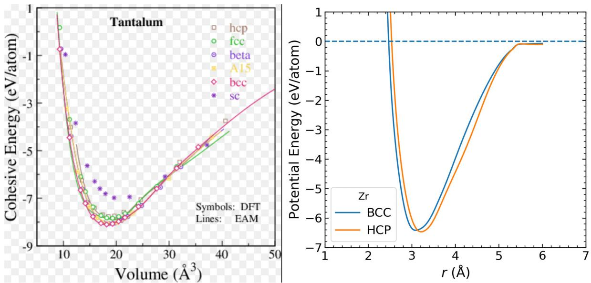  
Figure R1. The relative stability of different phases in Ta (left) and $Z \mathrm { r }$ (right) for the models developed by the respective authors. The data sources are provided in the text above.

\* The simulation cells contained only 16 O00 atoms. Can size effects be excluded? Does the simulation cell size potentially affect the nucleation process/statistics/kinetics?

R3. We agree with the Reviewer that finite-size effects should always be considered in computer simulations, though their influence is case-dependent, varying according to the specific research problem. In our study, we primarily focused on the results from simulations with $N { = } 1 6 { , } 0 0 0$ atoms. However, we also conducted simulations with larger system sizes ( $\scriptstyle N = 3 1 , 2 5 0$ and $\scriptstyle N = 5 4 , 0 0 0$ ), and as these did not qualitatively affect our findings,we neglected to mention them in the original manuscript.

To address the Reviewer's concern, we now discuss the potential effects of system size on the nucleation process， statistics，and kinetics. As the system size increases， there are more opportunities for spatial-temporal fluctuations, which could facilitate the formation of multiple nuclei.

(1) This could impact the nucleation time $\tau _ { X }$ . As shown by Trond et al. (PRX 9, 031016,2019), a system size scaling relation, $\tau _ { X } \sim 1 / N$ ， may be expected. However, our focus was on the differences in crystallization kinetics between $Z \mathbf { r }$ and Ta, rather than on the absolute values of nucleation times at the size limit.

(2) When multiple nuclei form, the analysis can become more complex, as we observed in simulations such as those shown in Fig. 5 and Supplementary Figs.5 and 6. For example, comparing Figs. 5a and $5 \mathrm { k } .$ ，we found that the presence of multiple nuclei does not alter the microscopic process of nucleation compared to a single nucleus. Additionally, the emergence of multiple nuclei can help improve nucleation statistics by reducing the required number of independent simulations, which is why we performed 30 independent simulations for better statistical accuracy. Nevertheless, studying crystallization in systems with much larger cels using more powerful computational resources is indeed an interesting avenue for future research.

We have added these additional details to the revised manuscript. (see page 31)

Comments on analysis and interpretation:

\* Fig. 2b: If Ta nucleates QCMP phases,I assume that it should after some time transition to bcc. Can this be observed in the simulation timescale?

R4.We thank the Reviewer for the valuable comment. In Fig. 2b, we classify the crystalization trajectories into two groups based on the final product: BCC or QCMP (primarily the o phase). Due to the metastable nature of the QCMP phase compared to BCC, any QCMP phase should eventually transform into BCC given enough simulation time. However, the exact timescale for this transformation will depend on the solid-solid phase transformation kinetics.

For example, in Fig. 5i, when BCC encounters the A15 phase, the interface is quite stable, making its migration difficult to observe. This issue is common in many systems, and enhanced sampling techniques are often required to accelerate the process (see Rogal et al., PRL 116, O35701 (2016) & PRL 123, 245701 (2019) [refs. 59, 60]). Fortunately, this process is observed in other cases where BCC is the final product. As shown in Fig.5a, the o phase nucleates before BCC nucleation, after which the BCC phase grows and overtakes the o phase. This transformation from QCMP to BCC is an interesting phenomenon for future study, especially with respect to crystal growth kinetics in a QCMP-BCC coexistence configuration.

# We have added this related discussion in the revised manuscript. (see page 23)

\* In principle,Eq. 2 should determine the shape of the TTT curves in Fig. 2b.However, this was not analyzed quantitatively. As far as I can see the difusion coefficient and the thermodynamic driving force were calculated, but the interface energy is not provided in the manuscript directly. Arguments are made based on the interface energy, but a direct calculation is missing.Ibelieve it would be feasible to perform such a calculation and a more quantitative argument using Eq. 2 can be made.Without this, the manuscript reads to me as very focused on the structural analysis, while neglecting this important thermodynamic property.

R5. We appreciate the Reviewer's comments. We have demonstrated that the diffusion coefficient and thermodynamic driving force are not the primary origins of the difference in glass-forming ability. Additionally，we have discussed the impact of interfacial energy based on a phenomenological Ginzburg-Landau-type approach. The significance of the interfacial energy is inferred from the crystallization kinetics and the underlying structural transformation mechanism. We believe that unveiling the structural origin of liquid crystallization is key to understanding the physical mechanism of glass-forming ability and to future materials design.

Nevertheless, as pointed out by the Reviewer, directly estimating the interfacial energy is crucial for the rigorous verification of our claims. Therefore, we followed the Reviewer's suggestion and estimated the liquid-solid interfacial energy for different solid phases by characterizing the atoms belonging to different liquid-solid interfaces, as suggested by Reviewer #2.

Inspired by the Reviewers’ suggestions, we also recognized that for Ta, different phases do not necessary share the same melting temperature $T _ { m }$ due to their distinct structure features. To investigate this further， we conducted additional simulations by constructing liquid-solid coexistent configuration and relaxing them at a series of temperatures. When the interfaces remained stable or the system's potential energy showed minimal change，we identified the corresponding temperature as the $T _ { m }$ of the solid phase.

As shown in Fig. R2(a-c), the melting temperature for BCC, $\sigma$ QCMP and A15-QCMP of Ta is $3 2 5 5 \pm 5$ K, $2 9 8 5 \pm 5 \mathrm { K }$ and $2 9 5 0 \pm 5 \mathrm { K } .$ ，respectively. Clearly, the BCC phase has a much higher $T _ { m }$ than the other metastable phases. Based on this finding, we carried out simulations to re-calculate the enthalpy of fusion at $T _ { m }$ for each phase. The enthalpy of the liquid and solid phases is shown in Fig. R2(d-f), respectively. The estimated enthalpy of fusion is $0 . 2 7 4 \pm 0 . 0 2 7 \ : \mathrm { e V / a t o n }$ 1 for BCC, $0 . 2 6 4 \pm 0 . 0 2 7$ eV/atom for $\sigma$ -QCMP，and $0 . 2 6 8 \pm 0 . 0 2 8 \ \epsilon$ V/atom for A15-QCMP, respectively. For comparison, Fig. R3 shows similar results for the BCC phase of $Z \mathbf { r } .$ ，where the melting point is determined to be $2 1 0 5 \pm 5 \ \mathrm { K } .$ ，and the enthalpy of fusion is $0 . 1 8 0 \pm 0 . 0 1 5$ eV/atom. The measured $T _ { m }$ values for the BCC phase of Ta and $Z \mathrm { r }$ are very close to the previous studies [Nature 512, 177 (2014) & Phys. Rev. E 90, 052403 (2014)]. Figure R4 compares the thermodynamic driving force of crystallization from the enthalpy of fusion of each phase. Only minor differences are observed, which is consistent with our previous analysis.

  
Figure R2. Estimation of the melting temperature and the enthalpy of fusion for different phases of Ta.(a-c） are the time dependence of the potential energy of the liquid-solid coexistent configuration at various temperatures. (d-f) present the time evolution of the enthalpy of the liquid and solid phases at the measured melting temperature for each phase.In (a-c) and (d-f) the phases are BCC, $\sigma$ QCMP and A15-QCMP, respectively.

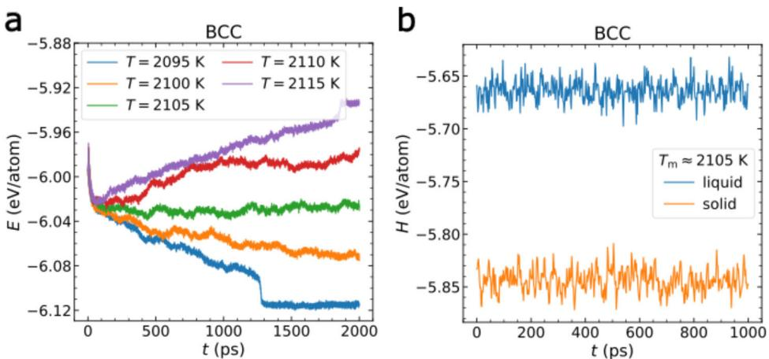  
Figure R3. Estimation of the melting temperature and the enthalpy of fusion for the BCC phase of Zr.

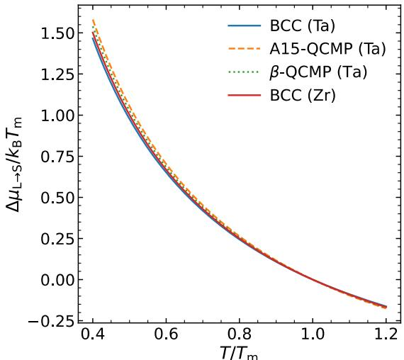  
Figure R4. The thermodynamic driving force of crystallization for different phases.

We then estimated the liquid-solid interfacial energy by using the free energy perturbation method. In this protocol, we considered two different states at $T _ { m }$ $( A )$ the pure liquid phase, and $( B )$ the liquid-solid coexistent phase with planar interfaces. To ensure sufficient sampling, we conducted long-time simulations to collect the potential energy. The free energy diference $\Delta F$ is then estimated by

$$
\begin{array} { r } { \Delta F ( T _ { m } ) = - k _ { \mathrm { B } } T _ { m } \mathrm { l n } \langle \exp \left[ - \frac { \langle U _ { A } ( t ) \rangle - U _ { B } ( t ) } { k _ { \mathrm { B } } T _ { m } } \right] \rangle _ { A } , } \end{array}
$$

where $k _ { \mathrm { B } }$ is the Boltzmann's constant and $U _ { x }$ is the potential energy of a state $x$ at time $t$ $\langle \cdots \rangle$ represents ensemble average. As the two states have the same free energy at $T _ { m }$ , the additional free energy $\Delta F ( T _ { m } )$ arises from the formation of the interfaces. The interfacial energy is thus estimated from $\gamma ( T _ { m } ) = N _ { i } \Delta F ( T _ { m } ) / A _ { i }$ ，where $N _ { i }$ represents the number of atoms on the interfaces and $A _ { i }$ denotes the interfacial area. Given the distinct structural characteristics of different phases, we considered particle-level and cluster-level information for the BCC phase and the QCMP phases. We visualized the interface meshes for these phases in Fig. R5. The estimated interfacial energy values of $\gamma ( T _ { m } )$ is 1.182, 1.162, $1 . 4 9 5 \mathrm { \ e V / n m } ^ { 2 }$ for BCC, $\sigma$ QCMP and A15-QCMP of Ta. The BCC phase of Zr has a lower value of $0 . 5 4 2 ~ \mathrm { e V } / \mathrm { n m } ^ { 2 }$ . This comparison aligns well with the above analysis from the crystallization kinetics. Additional computational details are provided in the Methods section.

In addition, as seen in Fig.R5,an interesting feature emerges: the surface mesh of the BCC phase appears rugged, particularly for $Z \mathbf { r } .$ ，whereas the QCMP phase exhibits relatively rather flat interfaces. This distinction likely arises from their differing interfacial energies. The interface morphology observed here warrants further investigation in future studies.

With the diffusion rate, thermodynamic driving force, and liquid-solid interfacial energy now available, we performed additional analysis for the TTT curves， following the Reviewer's suggestion. We fit equation (2) from the classical nucleation theory to the nucleation times of $Z \mathbf { r }$ and the BCC and QCMP phases of Ta.Figure R6 demonstrates how well equation (2) fits the data, with the estimated physical quantities, which indeed strengthens our discussion. This was made possible thanks to the Reviewer's constructive suggestion.

We add the related results and discussion to the revised manuscript. (see pages 14-16, 33-34)

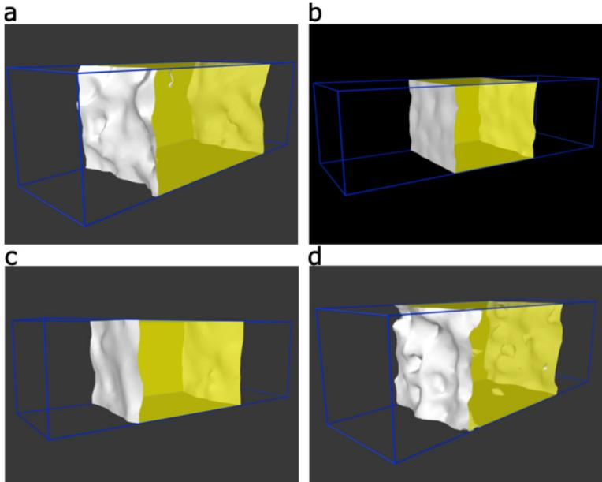  
Figure R5. Surface mesh of the solid phase in the liquid-solid coexistent configuration at $T _ { m }$ . (a) BCC of Ta; (b) $\sigma$ -QCMP of Ta; (c) A15-QCMP'of Ta; (d) BCC of $Z \mathrm { r }$ ，The gray surface demonstrates the liquid-solid interface, while the yellow region corresponds to the crystal phase. For better visualization, the liquid phase and all individual atoms are not shown.

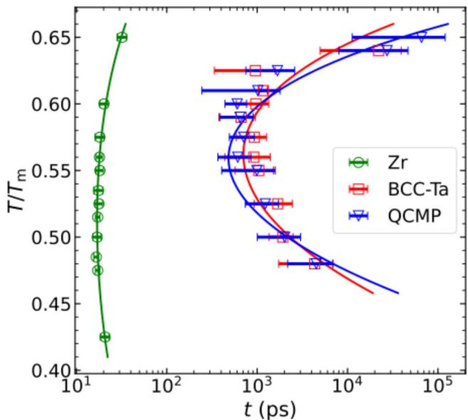  
Figure R6. The TTT curves of $Z \mathrm { r }$ and Ta, including both BCC and QCMP phases for Ta. The solid lines represent fits of the classical nucleation theory to the data (see equation (2) in the main text). QCMP refers to the $\sigma$ phase. $T _ { m }$ refers to the BCC phase of $Z \mathrm { r }$ and Ta respectively.

# Minor comments:

\* The second paragraph in the introduction is concerned with Li-ion batteries, which does not seem overly relevant to the present paper.

R6. We thank the Reviewer for raising this important point. The scientific significance of vitrifying monatomic metals has been well recognized in the field of metallic glasses and glass physics. Numerous studies have reported advancements in this area, such as the vitrification of Ge by Angell et al. (Nature 448, 787 (2007)), BCC metals by Zhong et al. (Nature 512, 177 (2014)), and FCC metals by Wang et al. (Nature Materials 23, 1193 (2024)). This inspires us to explore whether vitrification can be achieved for any metal in the periodic table. The scope of this inquiry can be expanded to other areas where the origin of glass-forming ability in monatomic metals remains unclear or has been overlooked.

One intriguing example is the vitrification of active metals like Li, Na, K, Mg, and Zn through electrochemical deposition, which holds great promise for high-performance batery design (Wang et al.,Nature Materials 19,1339 (2020)). The crystallization of lithium at solid interfaces is also mediated by an intermediate disordered state (Yang et al., Nature Communications 14, 2986 (2023)). This highlights the scientific importance of understanding phase transformation kinetics and the associated physical mechanisms in such materials. However,research in this area remains limited, providing an opportunity to apply our findings to address these questions.

Furthermore, the single-component phase-change material antimony (Sb) identified by Salinga et al. (Nature Materials 17, 681 (2018)) serves as another example where our work can contribute to advancing understanding. We hope to broaden the readership of our current study and facilitate interdisciplinary breakthroughs. We believe our study will offer valuable insights into the glassforming ability of these monatomic metals, and we look forward to expanding our findings in future work.

We have added additional discussion to the revised manuscript in both the Introduction and the Discussion sections to reflect this. (see pages 3,5, 29)

We sincerely thank the Reviewer for providing many constructive and valuable comments, which have been extremely helpful in improving our manuscript. We believe we have successfully clarified the novelty of our findings and addressed the Reviewer's comments thoroughly. In particular， the direct estimation of the interfacial energy，as suggested by the Reviewer, significantly enhances the robustness of our claims. We hope the Reviewer wil find the revised manuscript suitable for publication in Nature Communications.

Response to the comments of Reviewer #4

This paper discusses about Monatomic glass formation through competing order balance.

However, the work is not of significance to the field.   
There is so much literature available on this area.

The work doesn't support the conclusions and claims made in the paper.

There are many flaws in the data analysis, interpretation and conclusions.

The methodology followed needs to be revised.

The work doesn't meet the expected standards in the field.

In addition, enough details are not provided in the methods for the work to be reproduced.

Due to allte above, the paper can't be published in its present form.

(Response) We thank the Reviewer for providing a review report on our manuscript. We have made thorough revisions to our manuscript, and the concerns have been addressed in tandem with the more specific concerns of the other reviewers. We hope the Reviewer will find the revised manuscript suitable for publication in Nature Communications.

# Response to the comments of Reviewer #5

I co-reviewed this manuscript with one of the reviewers who provided the listed reports. This is part of the Nature Communications initiative to facilitate training in peer review and to provide appropriate recognition for Early Career Researchers who co-review manuscripts.

(Response) We thank the Reviewer for providing a joint review report on our manuscript. We have addressed each comment point-by-point in detail above. We hope that we have adequately responded to the Reviewer's feedback and that the revised manuscript is now suitable for publication in Nature Communications.

The reviewers'comments and suggestions are highly appreciated. We are addressing the comments point by point in the following. All revisions are marked in magenta.

Response to the comments of Reviewer #1

I find the authors have answered my questions and taken seriously my requests and suggestions for clarification. I find the contrast in the EAM potentials used, as shown in the supplementary material, particularly interesting (while agreeing that the supplementary material is the appropriate location for this). The comments below are mainly some remaining suggestions for clarification. Overall I am happy to recommend publishing.

(Response) We sincerely thank the Reviewer for carefully reading our revised manuscript and for the very positive and encouraging feedback. We are pleased that the Reviewer finds our revisions satisfactory and appreciates our efforts to address all previous comments in detail. We are particularly grateful for the Reviewer's recognition of the clarifications and additional analyses provided, including the comparison of EAM potentials and their placement in the supplementary material, which allowed for a more thorough and focused discussion in the main text.

In the following, we provide point-by-point responses to the additional suggestions for clarification raised by the Reviewer.

Detailed comments

Page 8   
In the sentence "The solidity parameter is essentially equivalent to the solid bond number" it is unclear which solidity parameter, s6 or s12 is referred to here; both were mentioned in the preceding sentence. My guess is s12.

R1. We thank the Reviewer for pointing out this ambiguity. Indeed, both $s _ { 6 }$ and $s _ { 1 2 }$ represent measures of bond solidity and are conceptually related to the solid bond number. In the specific sentence mentioned by the Reviewer, we were referring to $s _ { 1 2 }$ ， as correctly inferred. We have clarified this point explicitly in the revised manuscript to avoid confusion.

Page 9   
A very small thing: In the sentence "Following Russo et al." it seems unnecessary to include the same citation twice.

R2. We thank the Reviewer for noticing this redundancy. We have removed the duplicate citation in the revised manuscript.

I don't understand why the driving force for the QCMP phases is larger than that for the crystal phase if the latter is the thermodynamically preferred phase

R3. We thank the Reviewer for raising this important point. For Ta, we determined that the melting temperature $T _ { m }$ and the enthalpy of fusion $\Delta H _ { m }$ vary slightly among the different phases: BCC （ ${ T _ { m } } \mathrm { { = } } 3 2 5 5$ K, $\Delta H _ { m } { = } 0 . 2 7 4 ~ \mathrm { e V / }$ atom), $\sigma$ QCMP（ ${ { T } _ { m } } \mathrm { { = } } 2 9 8 5 \mathrm { ~ K ~ }$ ， $\Delta H _ { m } { = } 0 . 2 6 4$ eV/atom), A15-QCMP （ $T _ { m } { = } 2 9 5 0$ K, $\Delta H _ { m }$ =0.268 eV/atom). The thermodynamic driving force $\Delta \mu _ { L \right. S } ( T ) = \Delta H _ { m } \left( 1 - \frac { } { }$ $\frac { T } { T _ { m } } \bigg )$ , is indeed slightly larger for the BCC phase, which is the thermodynamically stable phase, compared to the QCMP phases.However, the differences are very small.

In Fig. 3b, we plotted the dimensionless driving force $\frac { \Delta \mu _ { L  S } } { k _ { B } T }$ as a function ofreduced temperature ${ \frac { T } { T _ { m } } } ,$ where $T _ { m }$ refers to the melting point of each specific phase. This normalization allows for a consistent comparison of thermodynamic driving forces across different phases and materials. To further clarify and avoid confusion, we have added Fig.3c in the revised manuscript, which directly compares AL forthediferent phases atthesmeabsolute temperatures.Assown,te differences remain small.

We have clarified these points in the revised manuscript to make the relationship between the driving force and phase stability more transparent.

The vertical axis of Fig 3b has a capital Delta in front of mu, while in Eq (2) and the text it is a small delta. On page 33 there is a capital Delta. A uniform choice should be made.

R4. We thank the Reviewer for carefully checking the manuscript and for pointing out this inconsistency. We have corrected the notation throughout the manuscript and now consistently use $^ { 6 6 } \Delta \mu _ { \mathrm { L }  S } \ '$ to denote the thermodynamic driving force.

Page 16 Equation (2) gives a rate, so this cannot be used directly to match nucleation times. How was it converted to a time, presumably you divide by the system volume? This depends on the actual definition of the rate I, which was not given (see my comment below under language).

R5. We thank the Reviewer for highlighting this important point.As correctly noted, the nucleation rate $I$ is related to the nucleation time $\tau _ { x t a l }$ and the system volume V through the relation $\tau _ { x t a l } =$ $\frac { 1 } { I V }$ [Phys.Rep. 476,51-124 (2009)]. To directly correspond with the nucleation times shown in Fig. 2b, we have modified Equation (3) [previous equation (2)] in the revised manuscript to express $\tau _ { x t a l }$ instead of $I .$ We have also added clarifying details in the revised manuscript to better explain this conversion.

Apart from the conversion to a nucleation time, what were the free fiting parameters in this process, and which were independently determined?

R6. We thank the Reviewer for this question. In the fitting process, the diffusion coefficients, thermodynamic driving forces， and liquid-solid interfacial energies were independently determined from our separate calculations. The remaining parameters in the nucleation model were treated as free fitting parameters. We have added this clarification to the revised manuscript.

Page 18   
Im not how how to interpret "the pathways show no significant dependence on undercooling   
degree". What exact feature of Fig 2 is being referred to here?

R7. We thank the Reviewer for pointing out this ambiguity. As shown in Fig. 2, the relative probability of forming QCMP or BCC changes with undercooling. However, the underlying atomic-scale crystallization mechanisms or pathways leading to QCMP or BCC—such as cluster attachment for QCMP or preordering for BCC—remain qualitatively the same acrossthe examined temperature range. We have revised the wording in the manuscript to clarify this point and avoid confusion.

In the next sentence it is stated that "above $0 . 6 \mathrm { T } \mathrm { ~ m ~ }$ ，BCC nucleation is difficult due to the low driving force" but I see nothing special about the temperature $0 . 6 \mathrm { T } \_ \mathrm { m }$ in Fig 3b, so what is the justification for this claim?

R8. We thank the Reviewer for this valuable observation. Indeed, as shown in Fig. 3b and our direct calculations, the thermodynamic driving forces for BCC and QCMP are very similar, without any distinct feature around $0 . 6 \mathrm { T _ { m } }$ . However, from Fig. 2a, we observed that when $\begin{array} { r } { \frac { T } { T _ { m } } > } \end{array}$ 0.60, QCMP nucleation becomes significantly more favorable compared to BCC. This preference likely arises from differences in interfacial energy rather than the driving force itself. We have revised the manuscript to clarify this point and avoid possible misinterpretation.

Page 20   
I suggest adjust the horizontal scales in Fig 5(c) and Fig 5(d) to be the same, ie both out of 20 or 25, so make comparison easier.

R9. We thank the Reviewer for the helpful suggestion.Following this advice, we have adjusted the horizontal scales in Fig. 5(c) and Fig. 5(d) to be consistent, which facilitates direct comparison between the two panels. The updated figure has been included in the revised manuscript.

Page 21 The "apparent spherical nature" of the nucleus is mentioned. Where can we see this? It's always good to explicitly remind the reader where they can check such things.

R10.We apologize for the confusion.The "apparent spherical nature" of the nucleus can be seen in Fig.5e-f of the main text. We have now explicitly added this figure reference in the revised manuscript to help readers easily locate the relevant visualization.

Page 22 I don't follw the sentence "The slightly higher nucleation driving force indicates its larger interfacial energy compared to BCC-Ta". How does the a larger interfacial energy follow from a high nucleation driving force? Normally I would consider these to be separate things? Or is that one can conclude this based on the "roughly simultaneous" nucleation mentioned in the previous sentence--i.e. in order to have roughly equal overallrates,the known slightly larger nucleation driving force must be somewhat cancelld by a larger interfacial energy ? If that is the correct interpretation of this sentence then I recommend rephrasing along the lines of what I wrote, e.g. "Given the slightly higher nucleation driving force, we can infer a larger interfacial energy compared to BCC-Ta, so that these increases cancel and give a similar overall nucleation rate".

R11. We thank the Reviewer for raising this important point. To avoid any confusion, we have removed the original sentence and now present this part in a purely descriptive manner, as both the thermodynamic driving force and interfacial energy have already been independently measured in our study. This revision ensures that no unnecessary inference is made.

Page 26 Where is the justification for stating "Excessive local icosahedral orders can also reduce GFA"? Where should the reader look to see this?

R12. We thank the Reviewer for this important question. In our current study, we observe that an excessive amount of local icosahedral order promotes quasi-crystallisation, driving the system toward an ordered rather than glassy state, thereby reducing the glass-forming ability (GFA). This behavior was also discussed in Ref.[15], where the role of icosahedral ordering in promoting quasi-crystal formation was proposed. Furthermore, similar trends were observed in our previous work using a binary patchy particle model in Ref.[14], where increasing icosahedral ordering beyond a certain threshold led to quasi-crystal formation and a reduction in GFA. We have clarified this point and added the relevant references in the revised manuscript.

Page 30 "Trond et al" should be "Ingebrigtsen et al",forreference 20[Trond is the main author's first name]

R13.We thank the Reviewer for catching this typo. We have corrected the reference in the revised manuscript and now list it correctly as “Ingebrigtsen et al."

Page 33 A reference for the empirical estimate of Delta mu $\scriptstyle \{ \mathrm { L } \to \mathrm { S } \}$ (T) would be nice.

R14. We thank the Reviewer for this suggestion. We have added the appropriate references supporting the empirical estimation, along with additional explanatory text, in the revised manuscript.

Language and typographical errors.

interphase $_ { - > }$ interface (I think)

R15. We thank the Reviewer for the careful reading. While we understand the potential confusion, in this context we are referring specifically to the solid-electrolyte interphase (SEI) — a widely used term in the battery field that denotes the passivation layer formed at the electrode/electrolyte interface.For this reason, we previously used the term“interphase.” However, as suggested by another Reviewer, we have removed this part from the Introduction in the revised manuscript.

Page 7   
"We refer QCMP to sigma- and/or A15-phase without diferentiation" $_ { - > }$ "We use QCMP to refer   
to both the sigma- and A15 phases without differentiation"

R16.We thank the Reviewer for the helpful suggestion. We have followed the Reviewer's suggestion and revised the manuscript accordingly.

Page 11 The end of the sentence "The final products are typically either BCC or sigma-QCMP, with A15-QCMP rarely coexists" needs to be rephrased or a missng word added (like "which" after "with"). Or maybe change "coexists"->"coexisting"

R17. We thank the Reviewer for pointing out the awkward phrasing. In our simulations, the final crystallization products are typically either BCC or o-QCMP, while A15-QCMP appears only rarely, either independently or coexisting with other phases. To clarify the sentence,we have replaced “coexists” with “appearing” in the revised manuscript.

Page 14,caption to figure 3 The subject is "is" in "but is approximately $\mathrm { D } ( \mathrm { Z r ) / D ( T a ) " }$ would seem to be Ta, but Ta is not approximately $\mathrm { D } ( \mathrm { Z r ) / D ( T a ) }$ . Rather insert "their ratio" before "is approximately"

R18. We thank the Reviewer for this helpful suggestion. Following the recommendation, we have revised the sentence in the caption to read: "their diffusion coefficient ratio is approximately $\mathrm { D } ( \mathrm { Z r ) / D ( T a ) " }$ to avoid ambiguity.

Page l4, equation (2) is presented as a definition the rate I, but it is not a definition ,but rather an expression which may or may be valid depending on how well CNT applies, for example. The definitino of I would be something along the lines of "the number of nucleations that occur per unit time per unit volume". Or it could be defined for a specific volume as just the number of nucleations per unit time.

R19. We thank the Reviewer for this important clarification. As correctly noted, the nucleation rate $I$ can be defined as the number of nucleation events per unit time per unit volume. It relates to the nucleation time $\tau _ { x t a l }$ and system volume $V$ by $\begin{array} { r } { \tau _ { x t a l } = \frac { 1 } { I V } } \end{array}$ [Phys. Rep. 476,51-124 (2009)]. In the revised manuscript, we have modified equation (3) [previously equation (2)] to directly express $\tau _ { x t a l }$ rather than $I ,$ to be consistent with the data shown in Fig. 2b. Additional explanation has also been added for clarity.

Page 17 The phrase "is estimated to reach $104 \%$ when assuming no connections" is a bit confusing;

it is easy to miss the fact that it is a counterfactual conditional. I suggest replacing with "would reach $104 \%$ if there were no connections"

R20. We thank the Reviewer for the helpful suggestion. We have followed the Reviewer's helpful suggestion and revised the manuscript accordingly.

Page 18 and several places in the following: pluralizing "local icosahedral orders" : order should be not be pluralized when it, as here,refers to the abstract notion of order. What the authors wish to pluralize is really sites which are distinguished by their high degree of local icosahedral order. So they could write, for example, "sites[or centers] of local icosahedral order" or use an abbreviation like "LIO-sites" or "LIO-centers".

EDIT: Ire-read the paper and wrote these comments before reading the rebuttal letter. After reading the rebuttal I realized that I had previously recommended against using the abbreviation ICO, so the term "local icosahedral order" is a response to my comments before,and one might think Im contradicting myself here. My main point is that pluralizing "order" in this context is wrong; I may not have realized when reading the first manuscript that multiple individual sites were being referred to.

R21. We thank the Reviewer for this careful clarification. We fully agree that pluralizing“order" is not appropriate in this context. Since the term“local icosahedral order” has already been used consistently throughout the manuscript, we have removed the unnecessary pluralization and kept the term in its singular form wherever applicable. We believe this wording is suficient to convey the intended meaning.

Page 24 Replace "even as" with "despite it being", before "a single-component system"

R22. We thank the Reviewer for the helpful suggestion. We have followed the Reviewer's helpful suggestion and revised the manuscript accordingly.

Page 25 I think "in the cluster level" should be "at the cluster level",though it is not clear what the "cluster level" is.

R23.We thank the Reviewer for this suggestion. We have revised the phrase from "in the cluster level" to "at the local cluster level" for proper usage. In this context, the“cluster level” refers to the structural scale at which local clusters (such as icosahedral clusters) form and contribute to quasi-crystallization， in contrast to ordinary crystallization， which proceeds primarily via individual atomic attachment. We have clarified this explanation in the revised manuscript.

We sincerely thank the Reviewer for providing many constructive and insightful comments, which have been extremely helpful in improving the quality and clarity of our manuscript. We hope that our revisions have fully addressed the Reviewer's concerns, and that the revised manuscript will now be considered suitable for publication in Nature Communications.

The authors have carefully answered to and revised all the comments of the reviewers. They have performed additional simulations and calculations. I particularly acknowledge the effort of the authors to estimate the values of interfacial energy and the topological characteristics of the interface between the liquid and the crystaline phases, which I think significantly strengthen the conclusions of the paper.

In the previous round, my recommendation to not publish the paper in Nat. Comm. was based on my assessment of relevance,the technical soundness of the work being clearly out of doubt. In this aspect,I have really enjoyed reading the response of the authors. I thank them for the clear, interesting and extended discussion provided in the response leter. In many aspects the results of this paper do not provide, in my opinion, a really different picture of the origins of glass forming ability with respect to previous literature. However, the authors are convincing about some relevant details of the crystallization pathways that this work highlights with respect to previous studies. As the authors clarify, this is indeed connected to the choice of monatomic metals in comparison to previous studies on multicomponent systems. Consequently,after considering the author responses, I recommend publication of the work in Nature Communications.

(Response) We sincerely thank the Reviewer for carefully reading our revised manuscript and response letter. We greatly appreciate the constructive feedback and are encouraged by the Reviewer's positive evaluation and recommendation for publication in Nature Communications.

# Response to the comments of Reviewer #3

The revised manuscript addresses many points raised by the reviewers, but in my opinion does not sufficiently address the questions regarding the interatomic potentials:

(Response) We sincerely thank the Reviewer for carefully reading our revised manuscript and response lettr. We appreciate the Reviewer's continued attntion to the important issue of the interatomic potentials. Below， we address the remaining concerns regarding the interatomic potentials point-by-point.

\* The response leter provides E-V curves for Ta and a bond energy curve as function of bond length for $Z \mathbf { r }$ ，The former comes from a website,which is therefore not citable as part of the scientific record. These details are also not provided in the updated manuscript. Additionally, an experimental melting point and critical cooling rate for glassformation of Ta is referenced (Nature 512, 177, 2024). For the melting point of $Z { \mathrm { { r } } } .$ ，only a simulation paper (Phys Rev E 90, 052404, 2014) is mentioned. This data (independent of its source) is important, but is still insufficient to fully evaluate the quality of the potentials for the present purpose. It is imperative that diffusion coefficients, free(!) energy of all relevant solids, free energy of the liquid,and interface energies are correct.For Zr, there is no data presented for, e.g., the FCC phase (which nevertheless seems to occur in the simulations,Fig. 2(d)) and the unstable phases (A15,o, etc.). The later is important in order to verify that the unstable phases are indeed unstable using the Zr potential. It is therefore impossible to say if the observed results and differences between Ta and $Z \mathbf { r }$ are realistic or due to deficiencies of the potentials.

R1. We sincerely thank the Reviewer for the constructive suggestions, and we addressthe concerns as follows:

The EAM potential for Ta was developed by Sheng et al.and reported in their original publication [Nature 512, 177 (2014)]. The development details and experimental benchmarks are described in the Methods section of the paper, with additional information available on the authors' website [https://sites.google.com/site/eampotentials/ta], which is also cited in their publication. While no separate publication exists that compiles these benchmarks, citing the original Nature paper provides access to the development and validation details.To further ensure that these benchmarks form part of the scientific record, as the Reviewer suggested, we have reproduced the equations of state (EOS) for the various solid phases of Ta in Fig. R1 (left panel). These calculations confirm that BCC is the stable phase, while A15 and o phases are metastable; FCC and HCP are higher in energy and thus unstable in Ta.

For Zr, Gunawardana et al. [Phys.Rev. E 90, O52403 (2014)] calculated the melting point using the same EAM potential and compared it to experimental values (see their Table I). To further corroborate this, we traced the experimental reference reporting a melting point of $1 8 5 5 ^ { \circ } \mathrm { C }$ in Journal of Phase Equilibria 11, 452 (1990).

To verify the phase stability in Zr using this potential, we also calculated the EOS for Zr (Fig. R1, right panel). The results show that HCP is correctly predicted as the stable phase, while BCC and FCC are metastable. Importantly, $\sigma$ and A15 phases are energetically unfavorable for Zr, consistent with expectations for this system.

Overall, the EOS results for both Ta and $Z \mathbf { r }$ are in good agreement with experimental data and previous benchmarks provided by the potential developers [Nature 512,177 (2014); Philos. Mag. 89, 967-987 (2009)]. These results support the reliability of the EAM potentials for exploring the crystallization pathways and glass-forming behavior discussed in our study.

We apologize for not providing these additional details in the earlier version of the manuscript. We have now included these data and corresponding discussion in the revised manuscript and Supplementary Information.

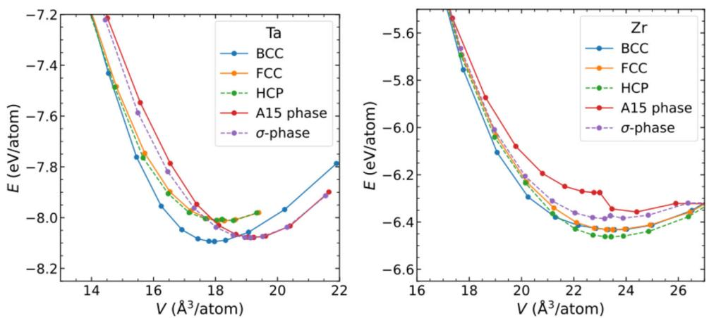  
Figure R1. Equations of state for various solid phases of Ta and Zr. ( $E$ : potential energy per atom, $V$ : average atomic volume). The equations of state were obtained by constructing perfect crystal structures of each phase and relaxing them at $5 0 \mathrm { K }$ to minimize thermal noise. The atomic volume was systematically varied to determine the corresponding potential energy.

\* Suppl. Fig. 8 shows a plot of the EAM potential functions. The authors note that “[...] a ruggedshaped potential model, favoring multiple local minima, likely promotes complex structures [...]". This is especially in reference to Ta, which has two deep minima in the pair term. This makes me quite skeptical about the applicability of the potentials: I would expect realistic potential energy functions to be smooth, not “rugged". If the manuscript's results depend on such details, it is imperative that the shape of the potential is verified (e.g., by DFT).

R2. We thank the Reviewer for raising this important point, which motivated us to investigate more carefully the shape of the interatomic potential. For the EAM potential of Ta, we revisited its development as reported in the original publication [Nature 512,177 (2014)]. As stated by the authors,“The potential, in the EAM formalism, was developed through fiting the potential energy landscape of Ta established through extensive ab initio calculations based on density functional theory (DFT).” In addition, the potential was fitted to reproduce a range of experimentally measured properties. Therefore, the rugged shape observed in the potential function is an outcome of this DFT-based fitting procedure and has, in this sense, already been verified against DFT and experimental data. The agreement with various physical properties of Ta further supports the validity of the potential.

Since the Reviewer raised concerns about the ruggedness of the pair potential, we extended our analysis to other independently developed interatomic potentials for diferent metals. In Fig. R2, we show examples for Cr, Mo, and Ni. The Mo and Ni potentials are machine-learning-based interatomic potentials, while the Cr potential is a modified EAM potential. All of these have been benchmarked against DFT and/or experiments by their respective developers.As can be seen, these potentials also exhibit non-smooth, rugged features in their pair interaction terms. This suggests that such ruggedness may not be an artifact, but rather reflects the complex nature of metallic bonding. Therefore, we respectfully disagree that metallic interatomic potentials necessarily need to be smooth. In fact, classical potentials such as Lennard-Jones are smooth but overly simplistic for describing metals, which require more complex potential landscapes.

We further note that the recent work by Mishin et al. [Comput. Mater. Sci. 205,111180 (2022)] developed a physics-informed neural network potential for Ta, which was benchmarked against experimental and DFT data. Interestingly, this independently developed potential also displays similar rugged features and reproduces the relative stability among BCC, A15, and $\beta$ Ta phases, providing additional support for the robustness of these rugged potential shapes in describing the energetics of Ta.

We have included this expanded discusson and supporting data in the revised manuscript and Supplementary Information to address the Reviewer's concerns more thoroughly.

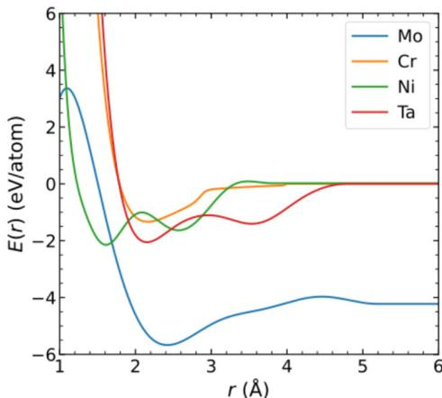  
Figure R2. Diatomic potential energy as a function of pair distance for four metals. The potentials shown correspond to: Cr (Choi et al., Computational Materials Science,130,121-129 (2017)); Mo and Ni (Zuo et al., The Journal of Physical Chemistry A,124,731-745 (2020); and Ta (Mishin et al., Computational Materials Science, 205,111180 (2022)).

\* I do not understand Suppl.Fig. 8(b)-(c). How were the pair and embedding term added together? The whole point of the EAM formulation is that the embedding term is a functional of the electron density term. Which electron density was used here and how did it vary with r?

R3.We thank the Reviewer for this detailed question, which allows us to clarify the calculation shown in Supplementary Fig. 1(b)-(c） [previous Suppl. Fig. 8]. As correctly noted, in the Embedded Atom Method (EAM), the total energy of an atom $i$ is given by:

$$
E _ { i } = F _ { \alpha } \left( \sum _ { j \neq i } \rho _ { \beta } \left( r _ { i j } \right) \right) + \frac { 1 } { 2 } \sum _ { j \neq i } \phi _ { \alpha \beta } ( r _ { i j } ) ,
$$

where $\mathrm { F }$ is the embedding energy, which depends on the local atomic electron density ${ \mathfrak { p } } ,$ and $\phi$ is the pair potential function. Both $\rho$ and $\phi$ are functions of the pair distance ${ \mathrm { { r } } } _ { \mathrm { { i j } } } ,$ and for our singlecomponent systems (Ta and $Z \mathrm { r }$ ）， ${ \mathfrak { a } } = \beta$ . The parameter functions F, p, and $\phi$ were obtained by the potential developers through DFT calculations with extensive experimental benchmarking. We directly extracted these functional terms from the source data of the employed EAM potentials and presented them in Fig. R3.

During simulations, for each atom, $\rho$ is accumulated by summing over all neighboring atoms within the cutoff distance,and F is then computed based on this summed electron density. The total energy is subsequently obtained by adding the embedding and pair terms.

However, in Supplementary Fig. 1(b)-(c), we are not showing full many-body simulation results, but rather illustrative diatomic calculations. That is, the total energy is computed for a system consisting of only two atoms,using the same formalism: p is evaluated based on the distance between just these two atoms, and the embedding energy F is then calculated from this value of p. This produces the energy-versus-distance curves shown in the figure. While this representation does not reflect the full multi-body environment of real simulations, it serves to visually illustrate how both the pair potential and embedding terms contribute as a function of distance.

In full simulations,of course, all neighbors within the cutoff contribute to p,and the calculations are fully dynamic,particularly in disordered or liquid states.

We have expanded and clarified these points in the revised manuscript and Supplementary Information to address the Reviewer's concerns.

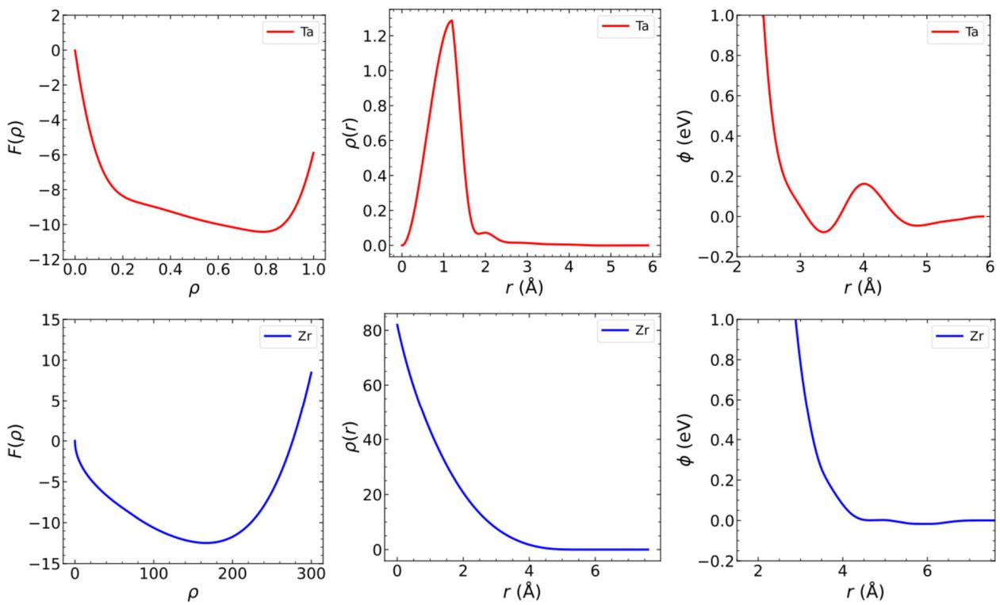  
Figure R3. Functional terms in the EAM potentials for Ta (upper panels) and $Z \mathbf { r }$ (lower panels). The left panels show the embedding function $F ( \rho )$ , the middle panels show the atomic electron density function $\rho ( r )$ , and the right panels show the pair potential $\phi ( r )$

Otherwise, the simulation methods seem reasonable to me and all relevant properties were properly calculated. However, if the results depend on the peculiar shape of the EAM potentials without verification that these are accurately representing the real material, the results are at the very least insufciently relevant for publication in Nature Communications. I do not believe that the potentials can stand in for something generalizable, because that would presume that the current results occur in at least one real material. I am aware that simulation studies sometimes even use ad-hoc potentials of various shapes to investigate what happens if certain parameters are tweaked. For a publication in a more specialized journal I would accept this under the caveat that the limitations are clearly discussed. For a journal aimed at a more general readership Ibelieve that the model must accurately reflect real materials.

R4. We thank the Reviewer for the thoughtful comments and for acknowledging that our simulation methods and property calculations are reasonable. As discussed above, the EAM potentials used in this study were developed through extensive DFT-based calculations and fitted to reproduce various experimentally measured properties. The resulting potential shapesincluding their "rugged" features—are outcomes of this fitting process and are not ad hoc or artificially imposed (see Fig. R2). These potentials have been validated against numerous key properties of Ta and Zr, such as phase stability, melting points, and relative energetics of different crystal structures.

We fully agree with the Reviewer that no empirical potential can perfectly reproduce all properties of real materials, and there are always limitations to any potential model. However, for the scope of the present study—investigating crystallization pathways, nucleation kinetics, and the role of competing ordering—the employed potentials reproduce essential experimental observations, including the well-known difference in glass-forming ability between Ta and Zr. In this sense, they serve as practical and physically meaningful models for exploring the crystallization mechanisms and providing insights that are challenging to obtain experimentally.

We also fully acknowledge that further development of more sophisticated and systematically validated interatomic potentials will be highly valuable to deepen our understanding of these systems. We regard the Reviewer's feedback as an important contribution in this ongoing effort. We hope that our explanations and the additional verifications provided in the revised manuscript address the concerns raised and demonstrate the relevance of our findings.

Other, minor comments:

$^ * \mathrm { ~ I ~ }$ still do not find the second paragraph in the introduction fitting for the subject mater of the manuscript. It seems designed to evoke“hot topics”, such as batteries, but the present work does not advance that field at all.

R5. We thank the Reviewer for this suggestion. While our original intention was to briefly highlight potential cross-disciplinary relevance, we fully agree that this paragraph is not essential to the central focus of the manuscript. Accordingly, we have removed the second paragraph from the introduction in the revised manuscript.

$^ * \mathrm { ~ I ~ }$ find the newly added reference to Shechtman's Nobel prize excessive. It again seems to refer to other influential work to prop up the impact of the present study. As a reader of the manuscript, this is not useful to me.

R6. We thank the Reviewer for this comment. Following the suggestion, we have removed the discussion related to Shechtman's Nobel Prize from the revised manuscript.

We sincerely thank the Reviewer once again for providing many constructive and valuable comments, which have been extremely helpful in improving and strengthening our manuscript. We hope that our revisions have fully addressed the Reviewer's concerns,and that the revised manuscript will now be considered suitable for publication in Nature Communications.

Response to the comments of Reviewer #5

Reviewer #5 (Remarks to the Author):

I co-reviewed this manuscript with one of the reviewers who provided the listed reports. This is part of the Nature Communications initiative to facilitate training in peer review and to provide appropriate recognition for Early Career Researchers who co-review manuscripts.

(Response) We thank the Reviewer for providing a joint review report on our manuscript. We have addressed each comment point-by-point in detail above. We hope that we have adequately responded to the Reviewer's feedback and that the revised manuscript is now suitable for publication in Nature Communications.

The reviewers' comments and suggestions are highly appreciated. We have addressed each comment point in detail, as outlined below.

Response to the comments of Reviewer #1

Reviewer #1 (Remarks to the Author):

Ihave read the rebuttal lettr and skimmed the latest version of the manuscript(focussing only on highlighted changes). I am satisfied with the changes made by the authors in response both to my comments and those of the other referee. A final smal language issue: Page 12 "rarely only appearing" $\mathbf { \delta } _ { - > }$ "only rarely appearing"

(Response) We thank the Reviewer for carefully reading our responses and revisions. We have implemented this language correction in the revised manuscript as suggested. We are grateful to the Reviewer once again for their constructive feedback, which has greatly helped improve our work.

Response to the comments of Reviewer #2

Reviewer #2 (Remarks to the Author):

In my opinion, the authors have satisfactorily replied to the comments of the reviewers and modified the manuscript and supplemental information accordingly. The question of how close the potentials used in molecular dynamics simulations represent reality is always there. As the authors state in the rebuttal later 'no empirical potential can perfectly reproduce the real material'. The potentials are obtained in certain conditions for the purpose to investigate how the material evolves under changing such conditions, considering the many-body interactions and the multiple local environments one can imagine during a crystallization process there will be always the doubt about how close to reality is the simulation. However,as far as I know, the authors are using the more realistic potentials available for the studied systems. I recommend publication of the paper.

(Response) We thank the Reviewer for carefully reading our responses and revisions, and for providing valuable comments and insightful discussion on the computer simulation potentials.We are grateful once again for the Reviewer's constructive suggestions, which have helped improve our work.

# Response to the comments of Reviewer #3

Reviewer #3 (Remarks to the Author):

Ithank the authors for discussing the interatomic potentials more thoroughly in the current version.This addresses the remaining criticism from the last review round.I thus now support the publication of this work in Nature Communications. While I believe that the subtleties of potentials discussed here are still under active investigation and future developments might well lead to better models of potential energy landscapes，the details/discussions that were provided by the authors now provide an accurate picture of the state of the art.

I noticed some issues/mistakes with the text that should be revised by the authors (without requiring further review):

(Response) We thank the Reviewer for carefully reading our responses and revisions. We are pleased that they find our revisions satisfactory and recommend publication of our work.We are also grateful for their constructive suggestions，which have helped improve the quality of our manuscript.

\* The references to supplemental figure numbers in the text seem out_of order. For example, Supplemental Figure 8 seems to be referenced as Supplemental Figure 1 in the main text. Please check all references to the Supplementary Information.

R1. We have corrected the order of the Supplementary Figures in the revised manuscripi to ensure consistency with the main text.

\* In the caption of Supplemental Figure 8 (b) and (c), please also state that this energy is for a diatomic system, just as in Supplemental Figure 10.

R2. We have added the term “Diatom" to the captions of panels (b) and (c) as suggested by the Reviewer.

\* The newly-inserted text in the beginning of the “Results” section， which explains the EAM potentials, seems more appropriate for the “Methods" section. Please check if it was erroneously inserted in the wrong place and consider moving this (important) section to "Methods".

R3. We thank the Reviewer for this helpful suggestion. As this part is important, as also noted by the Reviewer, we prefer to retain it in the Results section. To improve clarity for a broader readership,we have added a subsection title“Computer simulation models."

We thank the Reviewer again for this constructive feedback on the discussion of these potentials.